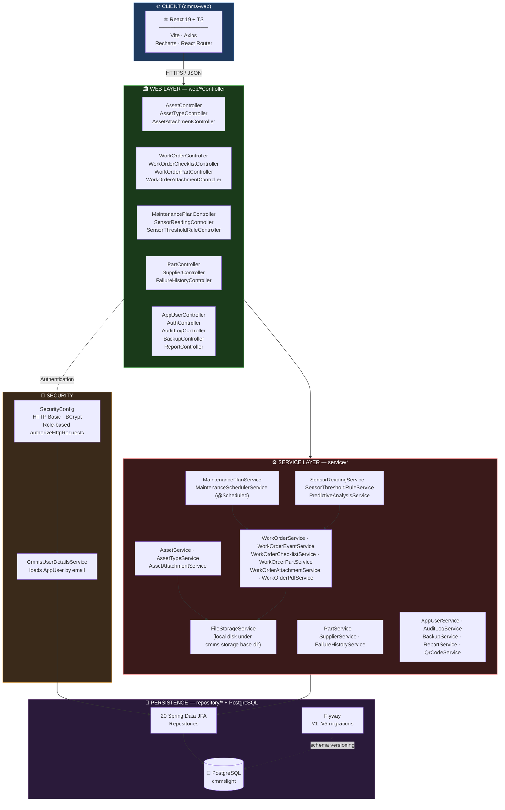
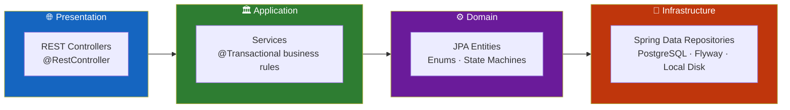
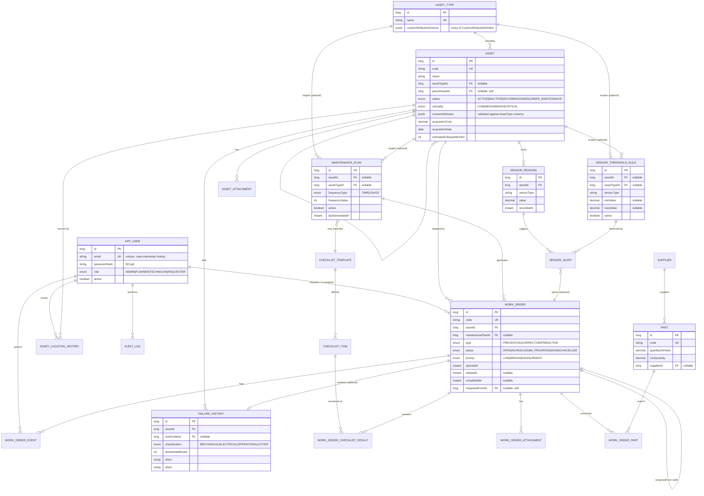
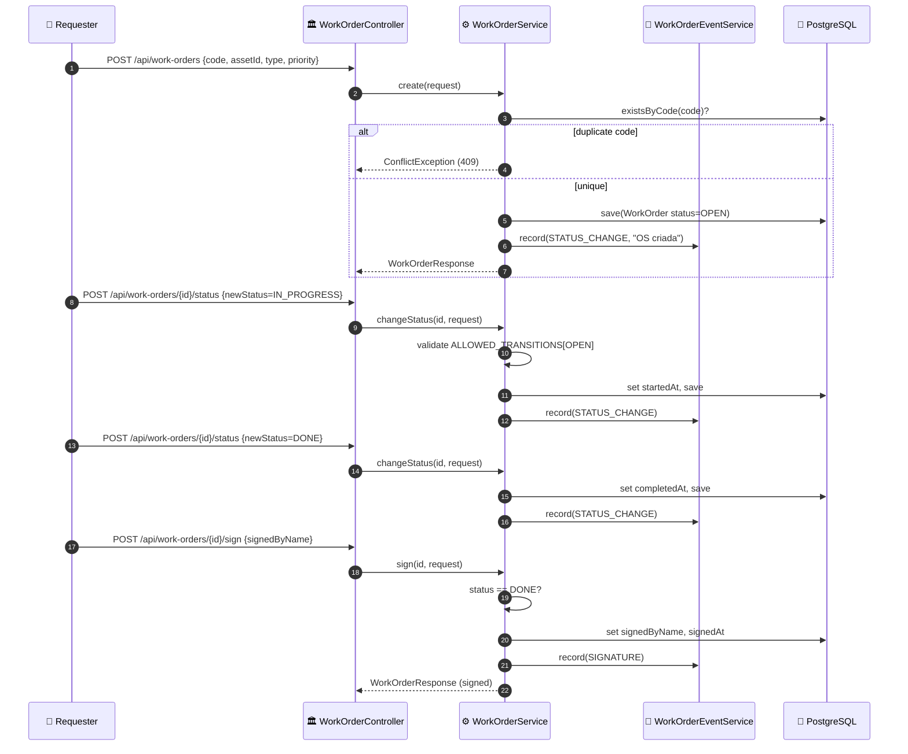
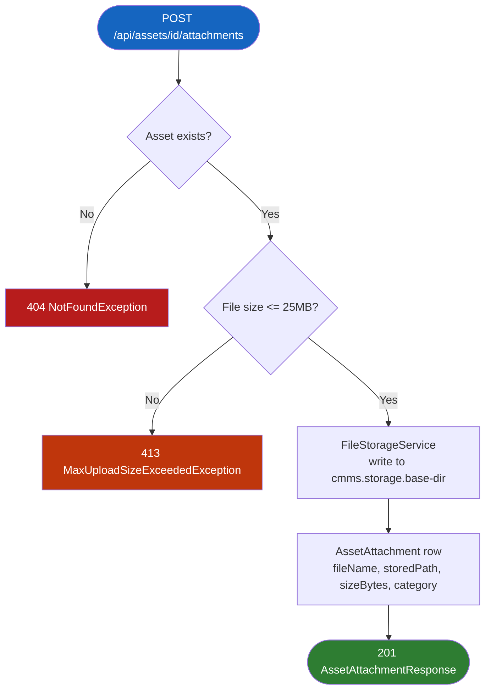
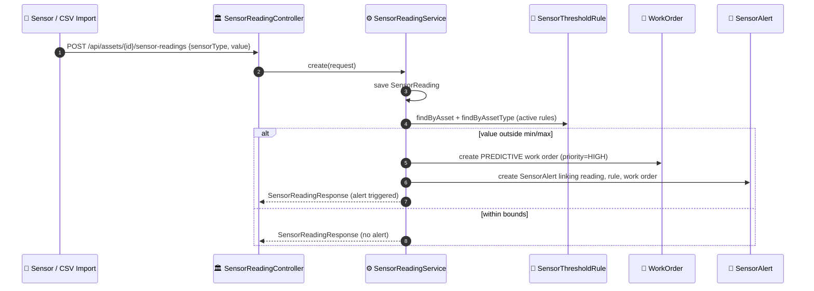
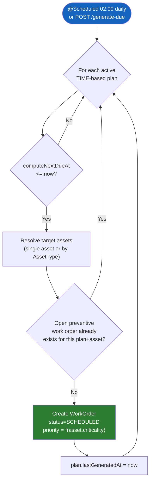
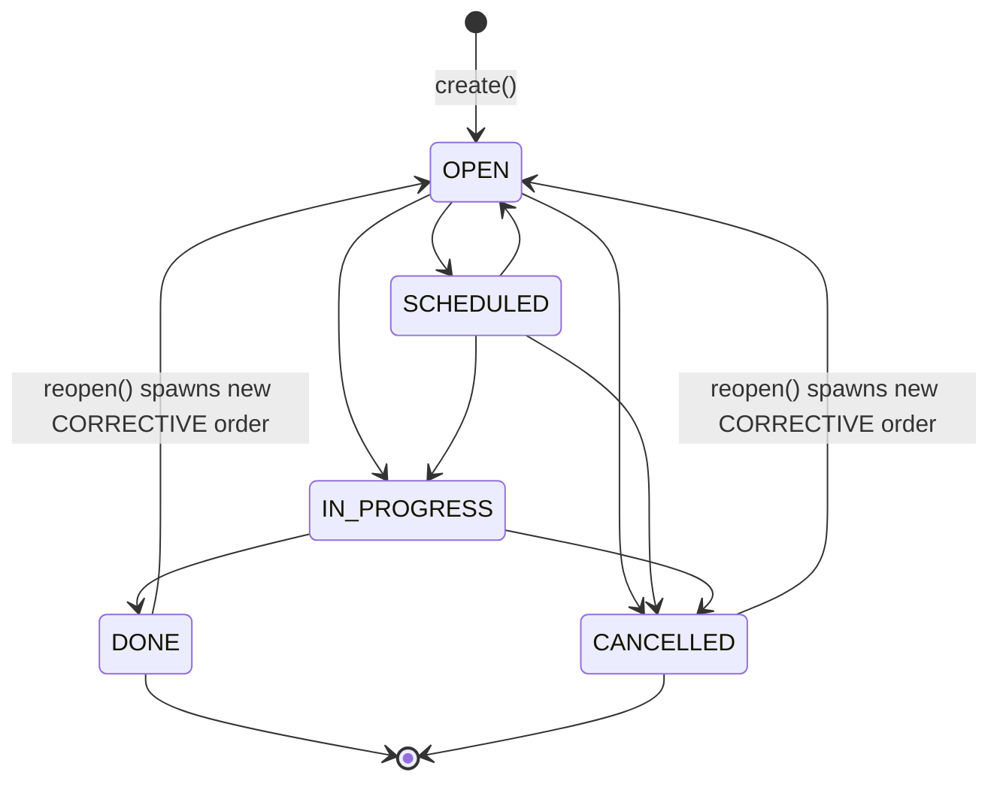
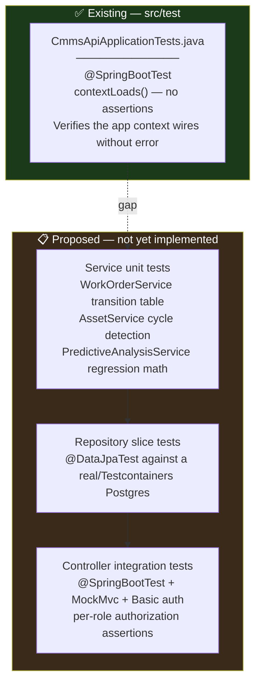

<div align="center">

**🌐 Choose Language / Selecione o Idioma / Elija el Idioma**

[](README.md)&nbsp;&nbsp;&nbsp;[](README_PT.md)&nbsp;&nbsp;&nbsp;[](README_ES.md)

</div>

---

<div align="center">

```
 ██████╗███╗   ███╗███╗   ███╗███████╗██╗     ██╗ ██████╗ ██╗  ██╗████████╗
██╔════╝████╗ ████║████╗ ████║██╔════╝██║     ██║██╔════╝ ██║  ██║╚══██╔══╝
██║     ██╔████╔██║██╔████╔██║███████╗██║     ██║██║  ███╗███████║   ██║
██║     ██║╚██╔╝██║██║╚██╔╝██║╚════██║██║     ██║██║   ██║██╔══██║   ██║
╚██████╗██║ ╚═╝ ██║██║ ╚═╝ ██║███████║███████╗██║╚██████╔╝██║  ██║   ██║
 ╚═════╝╚═╝     ╚═╝╚═╝     ╚═╝╚══════╝╚══════╝╚═╝ ╚═════╝ ╚═╝  ╚═╝   ╚═╝
        Computerized Maintenance Management System — Spring Boot API
```

---

[](https://openjdk.org/)
[](https://spring.io/projects/spring-boot)
[](https://www.postgresql.org/)
[](https://flywaydb.org/)
[](https://spring.io/projects/spring-security)
[](https://pdfbox.apache.org/)
[](https://github.com/zxing/zxing)
[](https://maven.apache.org/)

<br/>

> **A self-hosted Computerized Maintenance Management System backend**
> covering assets, work orders, preventive scheduling, sensor-driven predictive alerts and traceability, with zero external cloud dependencies.

<br/>


</div>

---

## 📑 Table of Contents

<details>
<summary>▶️ <strong>Click to expand / collapse this section</strong></summary>

<table>
<tr>
<td valign="top" width="50%">

**🏗️ System**
- [Overview](#-overview)
- [System Architecture](#-system-architecture)
- [Technology Stack](#-technology-stack)
- [Design Patterns](#-design-patterns-applied)
- [Project Structure](#-project-structure)

**📦 Modules**
- [App User & Auth](#-appuser--authcontroller--identity-and-roles)
- [Asset](#-asset--assettype--the-hierarchical-equipment-registry)
- [Asset Attachments & Location History](#-assetattachment--assetlocationhistory--evidence-and-traceability)
- [Work Order](#-workorder--the-central-execution-unit)
- [Work Order Sub-modules](#-workorderevent--workorderchecklistresult--workorderpart--workorderattachment)
- [Maintenance Plan & Scheduler](#-maintenanceplan--maintenanceschedulerservice--preventive-engine)
- [Sensor Reading, Threshold & Predictive Analysis](#-sensorreading--sensorthresholdrule--sensoralert--predictiveanalysisservice)
- [Failure History (RCA)](#-failurehistory--root-cause-analysis)
- [Part & Supplier](#-part--supplier--inventory)
- [Reports, Backup, QR & Audit](#-reportservice--backupservice--qrcodeservice--auditlogservice)

</td>
<td valign="top" width="50%">

**💼 Business**
- [Business Rules](#-business-rules)
- [Functional Requirements](#-functional-requirements)
- [Non-Functional Requirements](#-non-functional-requirements)

**📐 Design**
- [Data Model](#-data-model)
- [System Flows](#-system-flows)
- [Work Order Lifecycle](#work-order-lifecycle-flow)
- [Asset Attachment Upload](#asset-attachment-upload-flow)
- [Sensor Threshold Alert](#sensor-threshold-alert-flow)
- [Preventive Scheduling](#preventive-maintenance-scheduling-flow)
- [Work Order Status State Machine](#work-order-status-state-machine)

**🔐 Security & Ops**
- [Security](#-security)
- [Installation & Execution](#-installation--execution)
- [Automated Tests](#-automated-tests)
- [Metrics & Monitoring](#-metrics--monitoring)
- [Known Limitations](#-known-limitations)

</td>
</tr>
</table>

---

</details>

## 🌟 Overview

<details>
<summary>▶️ <strong>Click to expand / collapse this section</strong></summary>

**CMMSlight** is a self-hosted Computerized Maintenance Management System (CMMS) built with **Spring Boot 4.1** on **Java 21**. It lives in the `cmms-api` Maven module, backed by **PostgreSQL** and versioned with **Flyway**, and it exposes a REST API consumed by a companion React frontend in `cmms-web`. The project models the operational reality of an industrial maintenance department: a hierarchical registry of assets, work orders that move through a controlled lifecycle, preventive plans that generate work automatically, sensor readings that can trigger predictive maintenance, and a full audit trail.

The backend is deliberately dependency-light on infrastructure: authentication is local HTTP Basic against a `app_user` table, PDF generation uses Apache PDFBox, QR codes are rendered with ZXing, and database backups shell out to the local `pg_dump`/`psql` binaries. Nothing is delegated to a third-party SaaS. Every entity that matters for compliance (work orders, checklist answers, sensor alerts) writes a domain event or an audit log row, so the system produces its own paper trail without needing an external logging platform.

The domain is organized around five pillars: **Asset Management** (hierarchical assets, custom attribute schemas, QR labels, location history), **Work Order Execution** (status machine, assignment, checklists, parts consumption, PDF work orders, digital sign-off), **Preventive & Predictive Maintenance** (time/usage-based plans with a daily scheduler, sensor threshold rules that auto-open predictive work orders, simple linear-regression trend analysis), **Inventory** (parts, suppliers, minimum-stock alerts), and **Governance** (audit log, role-based authorization, local backup/restore, CSV/PDF/QR reporting).

### 🎯 System Objectives

| Objective | Description |
|-----------|-------------|
| 🏭 **Hierarchical Asset Registry** | Model parent/child equipment trees with per-`AssetType` custom attribute schemas |
| 🧾 **Controlled Work Order Lifecycle** | Enforce a strict state machine (`OPEN → SCHEDULED → IN_PROGRESS → DONE/CANCELLED`) with full event history |
| 🗓️ **Automatic Preventive Scheduling** | Generate due preventive work orders daily via a `@Scheduled` job, without an external job scheduler |
| 📡 **Predictive Alerts from Sensor Data** | Auto-open `PREDICTIVE` work orders when a sensor reading breaches a configured min/max threshold |
| 📈 **Lightweight Trend Analysis** | Compute mean, standard deviation, anomalies and a linear-regression threshold-breach ETA per sensor |
| 🧰 **Traceable Parts Consumption** | Link parts used per work order and track consumption history against a supplier |
| 🔍 **Root Cause Analysis** | Capture the 5-Whys and a failure classification per `FailureHistory` record |
| 🔐 **Role-Based Access Control** | Four roles (`ADMIN`, `PLANNER`, `TECHNICIAN`, `REQUESTER`) enforced per HTTP method and path |
| 🗄️ **Local Backup & Reporting** | Trigger `pg_dump`/`psql` backups and CSV daily summaries from within the API, no cloud storage |
| 🖨️ **Paperwork Automation** | Generate work order PDFs (PDFBox) and asset QR labels (ZXing) on demand |

---

</details>

## 🏗️ System Architecture

<details>
<summary>▶️ <strong>Click to expand / collapse this section</strong></summary>

### Module Diagram



### Architecture Layers



---

</details>

## 🛠️ Technology Stack

<details>
<summary>▶️ <strong>Click to expand / collapse this section</strong></summary>

<table>
<thead>
<tr>
<th>Layer</th>
<th>Technology</th>
<th>Version</th>
<th>Purpose</th>
</tr>
</thead>
<tbody>
<tr>
<td rowspan="2"><strong>🧠 Language</strong></td>
<td>Java</td>
<td>21</td>
<td><code>java.version</code> in <code>pom.xml</code></td>
</tr>
<tr>
<td>TypeScript</td>
<td>~6.0.2</td>
<td>Companion frontend (<code>cmms-web</code>), not part of this API module</td>
</tr>
<tr>
<td rowspan="2"><strong>🍃 Framework</strong></td>
<td>Spring Boot</td>
<td>4.1.0</td>
<td>Parent POM, autoconfiguration, embedded server</td>
</tr>
<tr>
<td>Spring MVC</td>
<td><code>spring-boot-starter-webmvc</code></td>
<td>REST controllers, `@RestControllerAdvice` error handling</td>
</tr>
<tr>
<td rowspan="3"><strong>💾 Persistence</strong></td>
<td>Spring Data JPA / Hibernate</td>
<td><code>spring-boot-starter-data-jpa</code></td>
<td>20 repositories over 20 entities, <code>ddl-auto=validate</code></td>
</tr>
<tr>
<td>PostgreSQL Driver</td>
<td>runtime scope</td>
<td>JDBC connectivity to <code>jdbc:postgresql://localhost:5432/cmmslight</code></td>
</tr>
<tr>
<td>Flyway</td>
<td><code>flyway-database-postgresql</code></td>
<td>5 versioned migrations (<code>V1</code>–<code>V5</code>) under <code>db/migration</code></td>
</tr>
<tr>
<td rowspan="2"><strong>🔐 Security</strong></td>
<td>Spring Security</td>
<td><code>spring-boot-starter-security</code></td>
<td>HTTP Basic, stateless sessions, role-based authorization</td>
</tr>
<tr>
<td>BCrypt</td>
<td><code>BCryptPasswordEncoder</code></td>
<td>Password hashing for <code>app_user.password_hash</code></td>
</tr>
<tr>
<td rowspan="2"><strong>✅ Validation</strong></td>
<td>Jakarta Bean Validation</td>
<td><code>spring-boot-starter-validation</code></td>
<td><code>@Valid</code> DTOs, <code>ConstraintViolationException</code> handling</td>
</tr>
<tr>
<td>Custom exceptions</td>
<td><code>ValidationException</code>, <code>ConflictException</code>, <code>NotFoundException</code></td>
<td>Domain-level rule enforcement mapped to HTTP status by <code>GlobalExceptionHandler</code></td>
</tr>
<tr>
<td rowspan="3"><strong>📄 Document / Media</strong></td>
<td>Apache PDFBox</td>
<td>3.0.3</td>
<td><code>WorkOrderPdfService</code> — printable work order PDFs</td>
</tr>
<tr>
<td>ZXing core + javase</td>
<td>3.5.3</td>
<td><code>QrCodeService</code> — asset QR label PNGs</td>
</tr>
<tr>
<td>Jackson Databind</td>
<td>via Spring Boot BOM</td>
<td>JSON serialization, JSONB (custom attributes) mapping</td>
</tr>
<tr>
<td rowspan="2"><strong>📊 Observability</strong></td>
<td>Spring Boot Actuator</td>
<td><code>spring-boot-starter-actuator</code></td>
<td>Exposes <code>/actuator/health</code> (permitted without auth)</td>
</tr>
<tr>
<td>Lombok</td>
<td>optional, excluded from fat JAR</td>
<td><code>@Getter</code>/<code>@Setter</code>/<code>@NoArgsConstructor</code> on entities</td>
</tr>
<tr>
<td rowspan="2"><strong>🔧 Build</strong></td>
<td>Maven Wrapper</td>
<td><code>mvnw</code> / <code>mvnw.cmd</code></td>
<td>Reproducible builds without a local Maven install</td>
</tr>
<tr>
<td>spring-boot-maven-plugin</td>
<td>—</td>
<td>Executable JAR packaging, excludes Lombok</td>
</tr>
<tr>
<td rowspan="1"><strong>🧪 Testing</strong></td>
<td>Spring Boot Test starters</td>
<td>actuator / data-jpa / flyway / validation / webmvc test starters</td>
<td>Test-scoped dependencies backing <code>@SpringBootTest</code></td>
</tr>
</tbody>
</table>

---

</details>

## 🎨 Design Patterns Applied

<details>
<summary>▶️ <strong>Click to expand / collapse this section</strong></summary>

| Pattern | Where | Rationale |
|---------|-------|-----------|
| 🧭 **Layered Architecture** | `web` → `service` → `repository` → `domain` | Controllers stay thin, business rules concentrate in `@Transactional` services |
| 🔁 **State Machine** | `WorkOrderService.ALLOWED_TRANSITIONS` (static `EnumMap<Status, Set<Status>>`) | Guarantees a work order can never skip an illegal status transition |
| 📢 **Domain Event Log** | `WorkOrderEventService.record(...)`, called from almost every mutating method | Every status change, comment, assignment, signature, checklist answer and part usage becomes a timeline entry |
| 🗂️ **Repository** | `repository/*Repository extends JpaRepository` | Decouples services from persistence details, enables derived query methods |
| 🏭 **DTO / Mapper** | `dto/*Request` and `dto/*Response` records, `toResponse()` private methods in every service | Entities never leak directly through the REST boundary |
| 🚦 **Guard Clause / Fail Fast** | `NotFoundException`, `ConflictException`, `ValidationException` thrown early in every service method | Keeps the happy path flat and centralizes error semantics in `GlobalExceptionHandler` |
| ⏰ **Scheduled Job** | `MaintenanceSchedulerService.generateDueWorkOrdersScheduled()` (`@Scheduled(cron)`), `BackupService.scheduledBackup()` | Recurring domain processes run in-process, no external cron/queue |
| 🧬 **Strategy via Enum Switch** | `MaintenanceSchedulerService.mapCriticalityToPriority`, `WorkOrderChecklistService.validateValue` | Behavior branches cleanly on a closed enum set |
| 🧩 **Schema-Driven Extension** | `AssetType.customAttributesSchema` (JSONB) validated against `Asset.customAttributes` in `AssetService` | Lets operators add custom fields per equipment type without a schema migration |
| 🔐 **Facade over OS Process** | `BackupService.runProcess(...)` wraps `pg_dump`/`psql` via `ProcessBuilder` | Backup/restore is exposed as a simple Java API, hiding the external process contract |

---

</details>

## 📁 Project Structure

<details>
<summary>▶️ <strong>Click to expand / collapse this section</strong></summary>

```
CMMSlight/
│
├── 📂 cmms-api/                              # Spring Boot backend (this README's subject)
│   ├── 📄 pom.xml                            # Maven build: Spring Boot 4.1.0 parent, Java 21
│   ├── 📄 mvnw / mvnw.cmd                    # Maven wrapper launchers
│   ├── 📄 HELP.md                            # Generated Spring Initializr reference links
│   │
│   └── 📂 src/
│       ├── 📂 main/
│       │   ├── 📂 java/com/cmmslight/cmmsapi/
│       │   │   ├── 📄 CmmsApiApplication.java   # @SpringBootApplication entry point
│       │   │   ├── 📂 domain/                   # 20 @Entity classes (Asset, WorkOrder, SensorReading, ...)
│       │   │   ├── 📂 dto/                      # Request/Response records for every controller
│       │   │   ├── 📂 repository/               # 20 Spring Data JPA repositories
│       │   │   ├── 📂 service/                  # 24 services (business rules, @Transactional)
│       │   │   │   └── 📂 storage/              # FileStorageService — local disk attachment I/O
│       │   │   ├── 📂 web/                      # 19 @RestController classes, 99 endpoints total
│       │   │   ├── 📂 security/                 # SecurityConfig, CmmsUserDetailsService
│       │   │   ├── 📂 config/                   # AppConfig, BackupProperties, FileStorageProperties
│       │   │   └── 📂 exception/                # ApiError, GlobalExceptionHandler, domain exceptions
│       │   │
│       │   └── 📂 resources/
│       │       ├── 📄 application.properties    # DB, Flyway, storage, backup, report config
│       │       └── 📂 db/migration/              # V1..V5 Flyway SQL scripts
│       │
│       └── 📂 test/java/com/cmmslight/cmmsapi/
│           └── 📄 CmmsApiApplicationTests.java  # Single Spring context smoke test
│
├── 📂 cmms-web/                               # React 19 + TypeScript + Vite frontend (separate module)
│   ├── 📄 package.json                        # axios, react-router-dom, recharts
│   └── 📂 src/                                # Not covered in depth by this backend-focused README
│
├── 📄 README.md                               # 🇺🇸 English (primary)
├── 📄 README_PT.md                            # 🇧🇷 Português
└── 📄 README_ES.md                            # 🇪🇸 Español
```

---

</details>

## 📦 System Modules

<details>
<summary>▶️ <strong>Click to expand / collapse this section</strong></summary>

### 👤 AppUser & AuthController — Identity and Roles

`AppUser` (`app_user` table) is the single identity model: `name`, unique `email`, BCrypt `passwordHash`, one of four `Role` enum values (`ADMIN`, `PLANNER`, `TECHNICIAN`, `REQUESTER`), an `active` flag and `createdAt`. `CmmsUserDetailsService` loads it by email for Spring Security, mapping the role to a `ROLE_*` authority. `AuthController` exposes `GET /api/auth/me`, resolving the authenticated principal back to an `AppUserResponse`.

| Endpoint | Method | Description |
|----------|--------|-------------|
| `/api/users` | GET / POST | List / create users (create, update, delete require `ADMIN`) |
| `/api/users/{id}` | GET / PUT / DELETE | Fetch, update or remove a user |
| `/api/auth/me` | GET | Resolve the current HTTP Basic principal to its `AppUser` profile |

---

### 🏭 Asset & AssetType — The Hierarchical Equipment Registry

`Asset` supports a self-referencing `parentAsset` (validated against cycles in `AssetService.isDescendant`), a `Status` (`ACTIVE`, `INACTIVE`, `DECOMMISSIONED`, `UNDER_MAINTENANCE`), a `Criticality` (`LOW`…`CRITICAL`, used to prioritize both work order queueing and preventive scheduling), warranty and acquisition fields, and a `customAttributes` JSONB blob validated at write time against the owning `AssetType.customAttributesSchema`. `AssetService.calculateCurrentDepreciatedValue` performs straight-line depreciation from `acquisitionCost`, `acquisitionDate` and `estimatedLifespanMonths`.

| Responsibility | Implementation |
|----------------|-----------------|
| Hierarchy traversal | `findRootAssets()`, `findChildren(id)` — `parentAsset IS NULL` / `parentAsset.id = ?` |
| Cycle prevention | `applyRequest` rejects self-parenting and ancestor loops before save |
| Custom attribute schema | `AssetType.customAttributesSchema` (JSON array of `CustomAttributeDefinition`), validated per type (`NUMBER`/`BOOLEAN`/`DATE`/`TEXT`) |
| QR labeling | `GET /api/assets/{id}/qrcode` — `QrCodeService.buildAssetQrContent` + ZXing PNG render |
| Location move | `POST /api/assets/{id}/move` — writes an `AssetLocationHistory` row and updates `Asset.location` atomically |

---

### 📎 AssetAttachment & AssetLocationHistory — Evidence and Traceability

`AssetAttachmentService` stores uploaded files (manuals, photos, documents) via `FileStorageService` under `cmms.storage.base-dir`, capping uploads at `spring.servlet.multipart.max-file-size=25MB`. Each attachment records `fileName`, `storedPath`, `contentType`, `sizeBytes` and a `Category` (`MANUAL`, `PHOTO`, `DOCUMENT`, `OTHER`). `AssetLocationHistory` is an append-only ledger of every location change, including who moved it and free-text notes.

| Endpoint | Method | Description |
|----------|--------|-------------|
| `/api/assets/{assetId}/attachments` | GET / POST | List / upload (multipart) attachments for an asset |
| `/api/assets/{assetId}/attachments/{attachmentId}/download` | GET | Stream the stored file with its original content-type |
| `/api/assets/{assetId}/attachments/{attachmentId}` | DELETE | Remove an attachment (disk + DB row) |
| `/api/assets/{id}/location-history` | GET | Full chronological move ledger for an asset |

---

### 🧾 WorkOrder — The Central Execution Unit

`WorkOrder` is the busiest entity: `Type` (`PREVENTIVE`, `CORRECTIVE`, `PREDICTIVE`), `Status` (`OPEN`, `SCHEDULED`, `IN_PROGRESS`, `DONE`, `CANCELLED`) governed by a hard-coded transition table in `WorkOrderService`, `Priority` (`LOW`…`URGENT`), links to `Asset`, an optional `MaintenancePlan`, `requestedBy`/`assignedTo` users, timestamps for every lifecycle point (`openedAt`, `scheduledAt`, `startedAt`, `completedAt`, `signedAt`), and a self-referencing `reopenedFrom` for rework traceability.

| Responsibility | Implementation |
|----------------|-----------------|
| Status transitions | `changeStatus()` validates against `ALLOWED_TRANSITIONS`, sets `startedAt`/`completedAt` automatically |
| Priority queueing | `GET /api/work-orders?queue` — sorted by `priority`, then `asset.criticality`, then `openedAt` (FIFO tiebreak) |
| Digital sign-off | `sign()` only permitted when `status == DONE`, records `signedByName` + `signedAt` |
| Rework | `reopen()` only from `DONE`/`CANCELLED`, spawns a new `CORRECTIVE` work order with code `<original>-R<n>` and `reopenedFrom` set |
| PDF export | `GET /api/work-orders/{id}/pdf` — `WorkOrderPdfService` renders a printable PDFBox document |
| Deletion guard | `delete()` rejects `IN_PROGRESS`/`DONE` work orders |

---

### 🔗 WorkOrderEvent · WorkOrderChecklistResult · WorkOrderPart · WorkOrderAttachment

These four entities compose the work order's execution surface:

| Sub-module | Role |
|------------|------|
| `WorkOrderEvent` | Immutable timeline row (`STATUS_CHANGE`, `COMMENT`, `ASSIGNMENT`, `SIGNATURE`, `CHECKLIST`, `PART_USED`) written by `WorkOrderEventService.record(...)`, exposed as `GET /api/work-orders/{id}/timeline` |
| `WorkOrderChecklistResult` | Per-item answer against a `ChecklistItem`, validated by type in `WorkOrderChecklistService.validateValue` (`YES_NO`/`NUMBER`/`MULTIPLE_CHOICE`/`TEXT`), aggregated into a compliance percentage via `GET .../checklist/compliance` |
| `WorkOrderPart` | Links a `Part` and `quantityUsed` to a work order (unique per `work_order_id`+`part_id`), feeding `PartConsumptionResponse` history |
| `WorkOrderAttachment` | Same storage model as `AssetAttachment` but scoped to a work order, categorized `BEFORE`/`AFTER`/`OTHER` |

---

### 🗓️ MaintenancePlan & MaintenanceSchedulerService — Preventive Engine

`MaintenancePlan` targets either a single `Asset` or an entire `AssetType`, with a `FrequencyType` of `TIME` (calendar-based) or `USAGE`. `MaintenanceSchedulerService` runs `@Scheduled(cron = "0 0 2 * * *")` every day at 02:00 server time, and the same logic is exposed manually via `POST /api/maintenance-plans/generate-due`. For each active `TIME` plan whose `computeNextDueAt` is due, it resolves target assets, skips any that already have an open preventive work order for that plan, and creates a `SCHEDULED` work order whose `Priority` is derived from `Asset.criticality`.

| Endpoint | Method | Description |
|----------|--------|-------------|
| `/api/maintenance-plans` | GET / POST | List / create plans |
| `/api/maintenance-plans/{id}` | GET / PUT / DELETE | Manage a single plan |
| `/api/maintenance-plans/overdue` | GET | Plans past their computed due date |
| `/api/maintenance-plans/calendar` | GET | Plans due within an `Instant` range |
| `/api/maintenance-plans/generate-due` | POST | Manually trigger the same job the 02:00 cron runs |

---

### 📡 SensorReading · SensorThresholdRule · SensorAlert · PredictiveAnalysisService

`SensorReading` records a timestamped numeric value per `Asset` and `sensorType`, either created individually or bulk-imported via `POST /api/assets/{assetId}/sensor-readings/import-csv` (columns `sensorType,value,unit,recordedAt`). Every save runs `SensorReadingService.checkThresholds`, matching against `SensorThresholdRule` rows scoped to the asset or its `AssetType`; a breach auto-creates a `PREDICTIVE` `WorkOrder` (priority `HIGH`) and a `SensorAlert` linking the reading, the rule and the generated work order. `PredictiveAnalysisService.trend()` computes mean, standard deviation, 2-sigma anomalies, a least-squares linear regression slope, and an estimated `Instant` at which the trend would cross the nearest threshold.

| Endpoint | Method | Description |
|----------|--------|-------------|
| `/api/assets/{assetId}/sensor-readings` | GET / POST | List / record readings for an asset |
| `/api/assets/{assetId}/sensor-readings/import-csv` | POST | Bulk CSV import, returns rows imported |
| `/api/assets/{assetId}/sensor-readings/trend` | GET | Mean/stdDev/anomalies/slope/estimated breach for a `sensorType` |
| `/api/sensor-threshold-rules` | GET / POST / PUT / DELETE | Manage min/max rules per asset or asset type |

---

### 🧯 FailureHistory — Root Cause Analysis

`FailureHistory` links a failure event to an `Asset` and optionally the `WorkOrder` that resolved it, tracking `failedAt`/`resolvedAt`, `downtimeMinutes`, a `Classification` (`MECHANICAL`, `ELECTRICAL`, `OPERATIONAL`, `OTHER`), and up to five free-text `why1`..`why5` fields implementing the 5-Whys technique. `FailureHistoryService.reliabilityRanking()` and `reliabilityForAsset()` back `AssetReliabilityStats`, aggregating failure counts and downtime per asset.

| Endpoint | Method | Description |
|----------|--------|-------------|
| `/api/failures` | GET / POST | List (optionally filtered by `assetId`) / register a failure |
| `/api/failures/{id}` | GET / PUT / DELETE | Manage a single failure record |
| `/api/failures/reliability/ranking` | GET | Assets ranked by reliability statistics |
| `/api/failures/reliability/{assetId}` | GET | Reliability stats for a single asset |

---

### 🔩 Part & Supplier — Inventory

`Part` tracks `quantityOnHand` and `minQuantity` (both `BigDecimal`) with an optional `Supplier` link; `PartController.belowMinimum()` returns items under their reorder point. `WorkOrderPartService` deducts/records consumption when parts are attached to a work order, and `PartController.consumption(id)` surfaces per-part usage history across work orders.

| Endpoint | Method | Description |
|----------|--------|-------------|
| `/api/parts` | GET / POST | List / register parts |
| `/api/parts/{id}` | GET / PUT / DELETE | Manage a single part |
| `/api/parts/below-minimum` | GET | Parts at or under `minQuantity` |
| `/api/parts/{id}/consumption` | GET | Consumption history for a part |
| `/api/suppliers` | GET / POST / PUT / DELETE | Full supplier CRUD |

---

### 🗃️ ReportService · BackupService · QrCodeService · AuditLogService

Four governance services close the loop: `ReportService` writes CSV daily summaries to `cmms.reports.directory` and lists/downloads them; `BackupService` shells out to `pg_dump`/`psql` (configured via `BackupProperties`) to `cmms.backup.directory`, also runnable on a weekly `@Scheduled(cron = "0 0 3 * * SUN")` job; `QrCodeService` renders asset QR PNGs with ZXing; `AuditLogService` records `CREATE`/`UPDATE`/`DELETE` actions with a `details` string for `Asset` and `WorkOrder` mutations, queryable by entity.

| Endpoint | Method | Description |
|----------|--------|-------------|
| `/api/reports` | GET | List generated report files |
| `/api/reports/daily-summary` | POST | Generate a new CSV daily summary |
| `/api/reports/{fileName}/download` | GET | Download a report file |
| `/api/backups` | GET / POST | List backups / run `pg_dump` now |
| `/api/backups/{fileName}/restore` | POST | Restore from a named backup file (path-traversal guarded) |
| `/api/audit-logs` | GET | List all, or filter by `entityName` + `entityId` |

---

</details>

## 💼 Business Rules

<details>
<summary>▶️ <strong>Click to expand / collapse this section</strong></summary>

### 🧾 Work Order Lifecycle Rules

| # | Rule | Enforcement |
|---|------|-------------|
| BR-01 | A work order status can only move along an allowed transition | `WorkOrderService.ALLOWED_TRANSITIONS` static map, `ValidationException` otherwise |
| BR-02 | `DONE` and `CANCELLED` are terminal, no further transitions allowed | Empty `EnumSet` for both in the transition map |
| BR-03 | `startedAt` is set exactly once, the first time status becomes `IN_PROGRESS` | Guard `if (entity.getStartedAt() == null)` in `changeStatus()` |
| BR-04 | `completedAt` is stamped when status becomes `DONE` | Unconditional set in `changeStatus()` |
| BR-05 | A work order cannot be deleted while `IN_PROGRESS` or `DONE` | `ConflictException` in `WorkOrderService.delete()` |
| BR-06 | Only a `DONE` work order can be digitally signed | `ValidationException` in `sign()` if status differs |
| BR-07 | Only `DONE` or `CANCELLED` work orders can be reopened, and reopening always creates a new `CORRECTIVE` order | `ValidationException` guard plus rework code `<original>-R<n>` in `reopen()` |
| BR-08 | The work order code must be unique | `ConflictException` on duplicate `code` in `create()`/`update()` |

### 🏭 Asset Rules

| # | Rule | Enforcement |
|---|------|-------------|
| BR-09 | An asset cannot be its own parent | `ValidationException` in `AssetService.applyRequest` when `parentAssetId == currentId` |
| BR-10 | An asset hierarchy cannot contain a cycle | `isDescendant()` walks the ancestor chain before accepting a new parent |
| BR-11 | An asset with existing child assets cannot be deleted | `ConflictException` in `AssetService.delete()` |
| BR-12 | Custom attribute values are validated against the owning `AssetType`'s schema, including required-ness and type (`NUMBER`/`BOOLEAN`/`DATE`/`TEXT`) | `validateAndSerializeCustomAttributes()` / `validateAttributeType()` |
| BR-13 | Changing an asset's `location` field always writes an `AssetLocationHistory` entry | `recordLocationHistory()` called on create (if location present) and on every update where location changed |
| BR-14 | The asset code must be unique | `ConflictException` on duplicate `code` |

### 📡 Predictive & Preventive Rules

| # | Rule | Enforcement |
|---|------|-------------|
| BR-15 | A sensor reading outside its rule's `minValue`/`maxValue` auto-creates a `PREDICTIVE` work order and a `SensorAlert` | `SensorReadingService.checkThresholds()` / `triggerAlert()` |
| BR-16 | Threshold rules apply at both asset-specific and asset-type levels, both are checked | `checkThresholds()` merges asset-scoped and asset-type-scoped active rules |
| BR-17 | A preventive work order is only generated when the plan is due and no open work order for that plan/asset pair already exists | `MaintenanceSchedulerService.hasOpenPreventiveWorkOrder()` guard |
| BR-18 | A required checklist item cannot be left unanswered, and answer format must match the item type | `WorkOrderChecklistService.validateValue()` |

---

</details>

## ✅ Functional Requirements

<details>
<summary>▶️ <strong>Click to expand / collapse this section</strong></summary>

| ID | Requirement | Priority | Status |
|----|-------------|----------|--------|
| **RF-01** | The system shall maintain a hierarchical registry of assets with parent/child relationships | 🔴 High | ✅ Implemented |
| **RF-02** | The system shall allow custom attribute schemas per asset type, validated on write | 🟡 Medium | ✅ Implemented |
| **RF-03** | The system shall generate a scannable QR code per asset | 🟢 Low | ✅ Implemented |
| **RF-04** | The system shall track asset location changes in an append-only history | 🟡 Medium | ✅ Implemented |
| **RF-05** | The system shall support file attachments for assets and work orders | 🟡 Medium | ✅ Implemented |
| **RF-06** | The system shall enforce a controlled work order status lifecycle | 🔴 High | ✅ Implemented |
| **RF-07** | The system shall queue open work orders ordered by priority and asset criticality | 🔴 High | ✅ Implemented |
| **RF-08** | The system shall record a full event timeline per work order | 🔴 High | ✅ Implemented |
| **RF-09** | The system shall generate a printable PDF per work order | 🟡 Medium | ✅ Implemented |
| **RF-10** | The system shall support digital sign-off of completed work orders | 🟡 Medium | ✅ Implemented |
| **RF-11** | The system shall allow reopening a completed or cancelled work order as rework | 🟡 Medium | ✅ Implemented |
| **RF-12** | The system shall support checklist templates attachable to work orders, with per-item compliance answers | 🔴 High | ✅ Implemented |
| **RF-13** | The system shall compute a checklist compliance percentage per work order | 🟡 Medium | ✅ Implemented |
| **RF-14** | The system shall track parts consumed per work order and expose consumption history | 🟡 Medium | ✅ Implemented |
| **RF-15** | The system shall generate preventive work orders automatically from time-based maintenance plans | 🔴 High | ✅ Implemented |
| **RF-16** | The system shall allow manually triggering the preventive generation job | 🟢 Low | ✅ Implemented |
| **RF-17** | The system shall record sensor readings per asset, individually or via CSV import | 🟡 Medium | ✅ Implemented |
| **RF-18** | The system shall auto-generate predictive work orders when a sensor reading breaches a threshold rule | 🔴 High | ✅ Implemented |
| **RF-19** | The system shall compute basic trend statistics (mean, standard deviation, anomalies, regression slope) per sensor | 🟡 Medium | ✅ Implemented |
| **RF-20** | The system shall track failure history with 5-Whys root cause fields and a reliability ranking | 🟡 Medium | ✅ Implemented |
| **RF-21** | The system shall manage parts and suppliers, flagging below-minimum stock | 🟡 Medium | ✅ Implemented |
| **RF-22** | The system shall record an audit log entry for asset and work order create/update/delete actions | 🔴 High | ✅ Implemented |
| **RF-23** | The system shall support local database backup and restore via `pg_dump`/`psql` | 🟡 Medium | ✅ Implemented |
| **RF-24** | The system shall generate CSV daily summary reports | 🟢 Low | ✅ Implemented |
| **RF-25** | The system shall authenticate users and enforce role-based access per endpoint | 🔴 High | ✅ Implemented |

---

</details>

## ⚡ Non-Functional Requirements

<details>
<summary>▶️ <strong>Click to expand / collapse this section</strong></summary>

| ID | Category | Requirement | Target |
|----|----------|-------------|--------|
| **RNF-01** | ⚡ Performance | Sensor CSV import processes rows sequentially in a single transaction | Acceptable for the batch sizes an operator uploads manually |
| **RNF-02** | 💾 Data Integrity | Schema changes are version-controlled and applied automatically at boot | `spring.flyway.enabled=true`, `ddl-auto=validate` (Hibernate never auto-alters the schema) |
| **RNF-03** | 🔐 Security | Passwords are never stored or logged in plain text | `BCryptPasswordEncoder` |
| **RNF-04** | 🔐 Security | Sessions are stateless; no server-side session state | `SessionCreationPolicy.STATELESS` |
| **RNF-05** | 📦 Footprint | File uploads are capped to avoid unbounded disk usage | `spring.servlet.multipart.max-file-size=25MB` / `max-request-size=25MB` |
| **RNF-06** | 🕒 Consistency | All timestamps are stored and compared in UTC | `hibernate.jdbc.time_zone=UTC`, `Instant`-typed columns |
| **RNF-07** | 🧱 Maintainability | Business rules stay outside controllers, in `@Transactional` services | Consistent `web → service → repository` layering across all 19 controllers |
| **RNF-08** | 🧪 Testability | Application context must boot cleanly with no wiring errors | `CmmsApiApplicationTests.contextLoads()` |
| **RNF-09** | 🔁 Reliability | Recurring domain jobs run without external infrastructure | In-process `@Scheduled` cron jobs (02:00 daily preventive generation, 03:00 Sunday backup) |
| **RNF-10** | 📈 Scalability | The domain model isolates read-heavy reporting queries from transactional writes at the service layer | Read-only query methods separated from `@Transactional` write methods |
| **RNF-11** | 🌍 Portability | The backend has no dependency on a specific cloud provider | Local disk storage, local `pg_dump`/`psql`, self-hosted PostgreSQL |
| **RNF-12** | 🧾 Auditability | Every asset and work order mutation leaves a traceable record | `AuditLogService.log(...)` + `WorkOrderEventService.record(...)` |
| **RNF-13** | ♿ Usability | API errors return a structured, consistent payload | `ApiError` record with `timestamp`/`status`/`error`/`message`/`fieldErrors` |
| **RNF-14** | 🔧 Configurability | Storage, backup and report paths are externally configurable | `FileStorageProperties`, `BackupProperties`, `cmms.reports.directory` in `application.properties` |

---

</details>

## 🗄️ Data Model

<details>
<summary>▶️ <strong>Click to expand / collapse this section</strong></summary>

### Entity-Relationship Diagram



### Configuration Keys (`application.properties`)

| Key | Default | Purpose |
|-----|---------|---------|
| `spring.datasource.url` | `jdbc:postgresql://localhost:5432/cmmslight` | Primary datastore connection |
| `spring.jpa.hibernate.ddl-auto` | `validate` | Schema is owned by Flyway, Hibernate only validates it |
| `spring.flyway.locations` | `classpath:db/migration` | Location of `V1`–`V5` SQL scripts |
| `cmms.storage.base-dir` | `./data/attachments` | Local disk root for asset/work order attachments |
| `cmms.backup.directory` | `./data/backups` | Where `pg_dump` writes `.sql` files |
| `cmms.backup.pg-dump-path` / `cmms.backup.psql-path` | `pg_dump` / `psql` | External binaries invoked via `ProcessBuilder` |
| `cmms.reports.directory` | `./data/reports` | Where generated CSV reports are written |
| `spring.servlet.multipart.max-file-size` | `25MB` | Per-file upload cap |

---

</details>

## 🔄 System Flows

<details>
<summary>▶️ <strong>Click to expand / collapse this section</strong></summary>

### Work Order Lifecycle Flow



### Asset Attachment Upload Flow



### Sensor Threshold Alert Flow



### Preventive Maintenance Scheduling Flow



### Work Order Status State Machine



---

</details>

## 🔐 Security

<details>
<summary>▶️ <strong>Click to expand / collapse this section</strong></summary>

### Implemented Controls

| Control | Implementation | Effect |
|---------|---------------|--------|
| 🔐 **HTTP Basic authentication** | `SecurityConfig.filterChain` → `.httpBasic(basic -> {})` | Every request except `/actuator/health/**` requires credentials |
| 🔑 **Password hashing** | `BCryptPasswordEncoder` bean | Passwords never stored or compared in plain text |
| 🧑‍🤝‍🧑 **Role-based authorization** | `authorizeHttpRequests` matchers keyed by `HttpMethod` + path pattern | `ADMIN` for users/audit-logs/backups; `ADMIN`/`PLANNER` for master-data writes; broader access for work order creation |
| 🚫 **Stateless sessions** | `SessionCreationPolicy.STATELESS` | No server-side session fixation surface |
| 🧾 **User lookup via repository** | `CmmsUserDetailsService.loadUserByUsername` uses `findByEmailIgnoreCase` | Case-insensitive login by email, disabled flag mapped from `AppUser.active` |
| ✅ **Centralized error mapping** | `GlobalExceptionHandler` never leaks stack traces, returns structured `ApiError` | Consistent 400/404/409/413/500 responses |
| 🧭 **Path traversal guard on restore** | `BackupService.restore` checks `source.startsWith(backupDir)` | Prevents restoring an arbitrary file outside the backup directory |
| 🏥 **Health endpoint isolation** | Only `/actuator/health/**` is `permitAll()` | No other actuator endpoint is exposed unauthenticated |

### Known Security Limitations

> [!WARNING]
> The following are inherent to the current design and should be understood before production use.

| Limitation | Risk | Mitigation path |
|------------|------|-----------------|
| 🔓 **CSRF protection disabled** | `csrf(csrf -> csrf.disable())` — acceptable for a stateless API consumed by a SPA with Basic auth, but risky if cookie-based auth is ever added | Re-enable CSRF or move to a token-based scheme (JWT) if session cookies are introduced |
| 🔑 **HTTP Basic over the wire** | Credentials are sent on every request; without HTTPS in front they travel in a decodable (Base64) form | Terminate TLS at a reverse proxy in front of the API before any real deployment |
| 🧵 **No rate limiting or brute-force protection** | `AuthController` / login attempts are not throttled | Add a rate limiter (e.g. Bucket4j) or account lockout policy |
| 🗄️ **Backup credentials read from `datasource.password`** | `BackupService` passes the DB password via `PGPASSWORD` env var to a spawned OS process | Acceptable for local ops; avoid running the API as a privileged OS user |
| 📄 **No field-level authorization** | Any authenticated user can read most GET endpoints regardless of role | Introduce method-level `@PreAuthorize` where read visibility needs to differ by role |
| 🔍 **No audit log entry for reads** | `AuditLogService.log` is only called from write paths (Asset, WorkOrder) | Extend audited entities/actions if read auditing becomes a requirement |
| 🧬 **No password complexity policy** | `AppUserService`/`AppUserRequest` do not enforce a minimum password strength beyond what Bean Validation declares | Add a custom validator for password complexity |
| 🗝️ **Single shared role granularity** | Roles are coarse (4 total); no per-asset or per-work-order ownership scoping | Add row-level ownership checks if multi-tenant isolation becomes necessary |

---

</details>

## 🚀 Installation & Execution

<details>
<summary>▶️ <strong>Click to expand / collapse this section</strong></summary>

### Prerequisites

```bash
# Java 21 JDK
java -version        # expect 21+

# PostgreSQL 13+ running locally, with a database and role matching application.properties
# spring.datasource.url=jdbc:postgresql://localhost:5432/cmmslight
# spring.datasource.username=cmmslight / spring.datasource.password=cmmslight
createdb -U postgres cmmslight
psql -U postgres -c "CREATE ROLE cmmslight LOGIN PASSWORD 'cmmslight';"

# pg_dump and psql available on PATH if you plan to exercise the backup endpoints
pg_dump --version
psql --version
```

### Build

```bash
cd cmms-api

# Compile, run tests, package the executable JAR
./mvnw clean package

# Compile only, skip tests
./mvnw clean package -DskipTests

# Run just the test suite
./mvnw test
```

### Execution

```bash
# Run directly via the Spring Boot Maven plugin (applies Flyway migrations on boot)
./mvnw spring-boot:run

# Or run the packaged JAR
java -jar target/cmms-api-0.0.1-SNAPSHOT.jar

# First login: seeded by V5__seed_admin_user.sql
# email: admin@cmmslight.local
curl -u admin@cmmslight.local:<seed-password> http://localhost:8080/api/auth/me
```

**Frontend (optional, separate module)**

```bash
cd cmms-web
npm install
npm run dev        # Vite dev server against the API on :8080
```

### Maven Targets

| Target | Purpose |
|--------|---------|
| `./mvnw clean` | Remove `target/` build artifacts |
| `./mvnw compile` | Compile sources only |
| `./mvnw test` | Run the test suite (`CmmsApiApplicationTests`) |
| `./mvnw package` | Build the executable JAR into `target/` |
| `./mvnw spring-boot:run` | Run the application with the embedded server |
| `./mvnw dependency:tree` | Inspect the resolved dependency graph |

### Build Configuration

| Setting | Value | Declared in |
|---------|-------|-------------|
| `groupId` / `artifactId` | `com.cmmslight` / `cmms-api` | `pom.xml` |
| `version` | `0.0.1-SNAPSHOT` | `pom.xml` |
| Parent POM | `spring-boot-starter-parent:4.1.0` | `pom.xml` |
| `java.version` | `21` | `pom.xml` `<properties>` |
| `server.port` | default `8080` (not overridden) | Spring Boot defaults |
| Lombok annotation processing | wired into `maven-compiler-plugin` executions | `pom.xml` `<build><plugins>` |

---

</details>

## 🧪 Automated Tests

<details>
<summary>▶️ <strong>Click to expand / collapse this section</strong></summary>

> [!IMPORTANT]
> The repository currently contains **exactly one** automated test: `CmmsApiApplicationTests.contextLoads()`, a Spring context-load smoke test with no assertions of its own. There is no controller, service, repository or integration test coverage beyond confirming the application boots. Any claim otherwise would be false — this section states that plainly, per project policy.

### Test Architecture (current state)



| Test file | Location | Type | Coverage |
|-----------|----------|------|----------|
| `CmmsApiApplicationTests.java` | `src/test/java/com/cmmslight/cmmsapi/` | `@SpringBootTest` | Application context boot only |

### Running the Tests

```bash
cd cmms-api

# Run the existing suite (one test)
./mvnw test

# Report location
# target/surefire-reports/com.cmmslight.cmmsapi.CmmsApiApplicationTests.txt
```

### Proposed Suite (not yet implemented)

| Area | Suggested test | Rationale |
|------|-----------------|-----------|
| `WorkOrderService` | Parameterized test over `ALLOWED_TRANSITIONS` asserting every forbidden pair throws `ValidationException` | The state machine is the single most safety-critical rule in the system |
| `AssetService` | Cycle-detection test: attempt to set an asset's parent to one of its own descendants | `isDescendant()` currently has no automated regression coverage |
| `SensorReadingService` | Threshold breach test asserting a `PREDICTIVE` `WorkOrder` and `SensorAlert` are created on out-of-range values | Core predictive-maintenance guarantee |
| `PredictiveAnalysisService` | Unit test for `linearRegressionSlope` against a known dataset with a hand-computed slope | Pure-math method, ideal for fast unit testing |
| `MaintenanceSchedulerService` | Test that a plan with an existing open work order is skipped | Prevents duplicate preventive work order generation |
| `GlobalExceptionHandler` | `@WebMvcTest` asserting each exception type maps to its documented HTTP status | Contract stability for API consumers |

### Manual Acceptance Checklist

| # | Scenario | Expected result |
|---|----------|-----------------|
| 1 | `POST /api/work-orders` with a duplicate `code` | `409 Conflict` |
| 2 | `POST /api/work-orders/{id}/status` from `OPEN` to `DONE` directly | `400 Bad Request` (illegal transition) |
| 3 | `POST /api/work-orders/{id}/sign` while status is `OPEN` | `400 Bad Request` |
| 4 | `PUT /api/assets/{id}` setting `parentAssetId` to a descendant | `400 Bad Request` (cycle rejected) |
| 5 | `DELETE /api/assets/{id}` on an asset with children | `409 Conflict` |
| 6 | `POST /api/assets/{id}/sensor-readings` with a value outside a configured rule | New `PREDICTIVE` work order appears in `/api/work-orders?status=OPEN` |
| 7 | `POST /api/maintenance-plans/generate-due` twice in a row | Second call generates 0 (already-open guard) |
| 8 | Login with wrong password | `401 Unauthorized` |
| 9 | `POST /api/assets` as a `REQUESTER` role | `403 Forbidden` |
| 10 | `GET /api/work-orders/{id}/pdf` | Downloads a valid PDF document |

---

</details>

## 📊 Metrics & Monitoring

<details>
<summary>▶️ <strong>Click to expand / collapse this section</strong></summary>

### Codebase Metrics

| Metric | Value |
|--------|-------|
| JPA Entities (`domain/`) | 20 |
| REST Controllers (`web/`) | 19 |
| Total REST endpoints (`@*Mapping` methods) | 99 |
| Services (`service/` + `service/storage/`) | 24 |
| Spring Data Repositories | 20 |
| DTO records (`dto/`) | ~40 (Request/Response pairs) |
| Custom domain exceptions | 3 (`NotFoundException`, `ConflictException`, `ValidationException`) |
| Flyway migrations | 5 (`V1`–`V5`) |
| Automated test files | 1 (context-load smoke test only) |
| Scheduled jobs | 2 (`@Scheduled` — daily 02:00 preventive generation, weekly Sunday 03:00 backup) |

### Runtime Signals

| Signal | Source | Where to observe |
|--------|--------|------------------|
| Application health | Spring Boot Actuator | `GET /actuator/health` (unauthenticated) |
| Preventive generation runs | `MaintenanceSchedulerService` | `WorkOrderEvent` rows with message "OS gerada automaticamente pelo motor de manutencao preventiva" |
| Predictive alerts | `SensorReadingService.triggerAlert` | `SensorAlert` table, linked `WorkOrder` with `type=PREDICTIVE` |
| Audit trail | `AuditLogService` | `GET /api/audit-logs?entityName=Asset&entityId={id}` |
| Backup history | `BackupService.listBackups()` | `GET /api/backups`, files under `cmms.backup.directory` |

### Useful Diagnostic Commands

```bash
# Tail application logs (stdout, when run via mvnw/java -jar)
./mvnw spring-boot:run 2>&1 | tee cmms-api.log

# Check the actuator health endpoint
curl http://localhost:8080/actuator/health

# Inspect the Flyway migration history table
psql -U cmmslight -d cmmslight -c "SELECT version, description, success FROM flyway_schema_history ORDER BY installed_rank;"

# List generated backup files on disk
ls -la cmms-api/data/backups/

# Count open work orders directly in the database
psql -U cmmslight -d cmmslight -c "SELECT status, count(*) FROM work_order GROUP BY status;"
```

### Standardized Response / Status Codes

| Code | Meaning | Source |
|------|---------|--------|
| `200 OK` | Successful GET/PUT/POST that returns a body | Default Spring MVC mapping |
| `201 Created` | Successful resource creation | `@ResponseStatus(HttpStatus.CREATED)` on create endpoints |
| `204 No Content` | Successful delete | `@ResponseStatus(HttpStatus.NO_CONTENT)` on delete endpoints |
| `400 Bad Request` | `ValidationException`, `MethodArgumentNotValidException`, `ConstraintViolationException` | `GlobalExceptionHandler` |
| `401 Unauthorized` | Missing or invalid HTTP Basic credentials | Spring Security filter chain |
| `403 Forbidden` | Authenticated but role lacks the required authority | `authorizeHttpRequests` matcher denial |
| `404 Not Found` | `NotFoundException` | `GlobalExceptionHandler` |
| `409 Conflict` | `ConflictException` (duplicate code, illegal delete, illegal state) | `GlobalExceptionHandler` |
| `413 Payload Too Large` | `MaxUploadSizeExceededException` | `GlobalExceptionHandler` |
| `500 Internal Server Error` | Any unhandled `Exception` | `GlobalExceptionHandler` catch-all |

---

</details>

## ⚠️ Known Limitations

<details>
<summary>▶️ <strong>Click to expand / collapse this section</strong></summary>

> [!IMPORTANT]
> CMMSlight is a functional, self-hosted CMMS backend but it has not been hardened for a multi-tenant or internet-facing production deployment. The items below are honest, source-grounded gaps, not speculation.

| Category | Issue | Status |
|----------|-------|--------|
| 🧪 **Test coverage** | Only a context-load smoke test exists; no unit, slice or integration tests | ⚠️ Open — see the Proposed Suite in Automated Tests |
| 🔐 **CSRF disabled** | `SecurityConfig` disables CSRF protection outright | ➕ Intentional for a stateless Basic-auth API, revisit if cookie auth is added |
| 🔑 **HTTP Basic only** | No JWT/OAuth2/refresh-token flow; credentials sent on every call | ⚠️ Open — acceptable behind TLS, but no token expiry or revocation exists |
| 🧵 **No rate limiting** | Authentication endpoints are not throttled against brute force | ⚠️ Open |
| 📦 **No pagination** | All `findAll()`-style endpoints return the full table as a `List` | ⚠️ Open — will not scale gracefully to very large asset/work-order tables |
| 🌐 **No CORS configuration found** | `SecurityConfig` does not declare a `CorsConfigurationSource` | ⚠️ Open — the `cmms-web` frontend likely needs an explicit allow-list in a non-same-origin deployment |
| 🧾 **License unset** | `pom.xml` has an empty `<licenses><license/></licenses>` block and no `LICENSE` file exists at the repository root | ⚠️ Open |
| 🐳 **No container artifacts** | No `Dockerfile` or `docker-compose.yml` was found for `cmms-api` or `cmms-web` | ⚠️ Open — deployment currently assumes a manually provisioned JVM + PostgreSQL host |
| 🧮 **Usage-based maintenance plans are modeled but not scheduled** | `MaintenancePlan.FrequencyType.USAGE` exists as an enum value, but `MaintenanceSchedulerService` only processes `TIME` plans | ⚠️ Open — usage-based triggering (e.g. from sensor-derived runtime hours) is not implemented |
| 🗄️ **Backup/restore assumes local trusted OS access** | `pg_dump`/`psql` run as external processes with the same OS privileges as the API | ➕ Intentional for a self-hosted deployment |

> [!TIP]
> The single highest-value improvement is adding **pagination to the list endpoints** (`Pageable` + `Page<T>` responses across `AssetController`, `WorkOrderController`, `SensorReadingController`, etc.), since every list currently loads the entire table into memory and every downstream consumer (frontend, reports, audit queries) will hit that ceiling first as data grows.

</details>

---

<div align="center">

---

### 🔧 CMMSlight

*One backend, every asset's whole story — from acquisition to depreciation to the last work order.*

[](https://openjdk.org/)
[](https://spring.io/projects/spring-boot)
[](https://www.postgresql.org/)
[]()

<br/>

```
"Maintenance deferred is downtime invited —
 the ledger of every asset should outlive the memory of any one technician."
```

</div>
</content>
