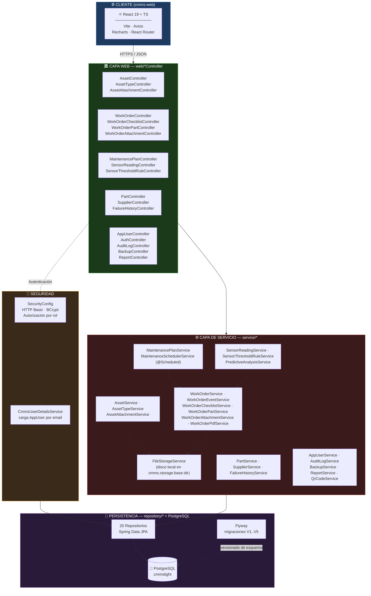
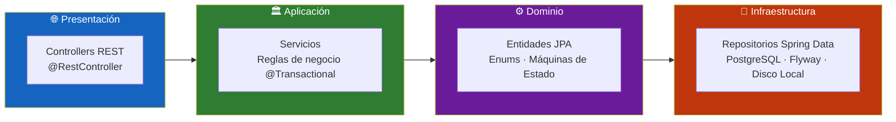
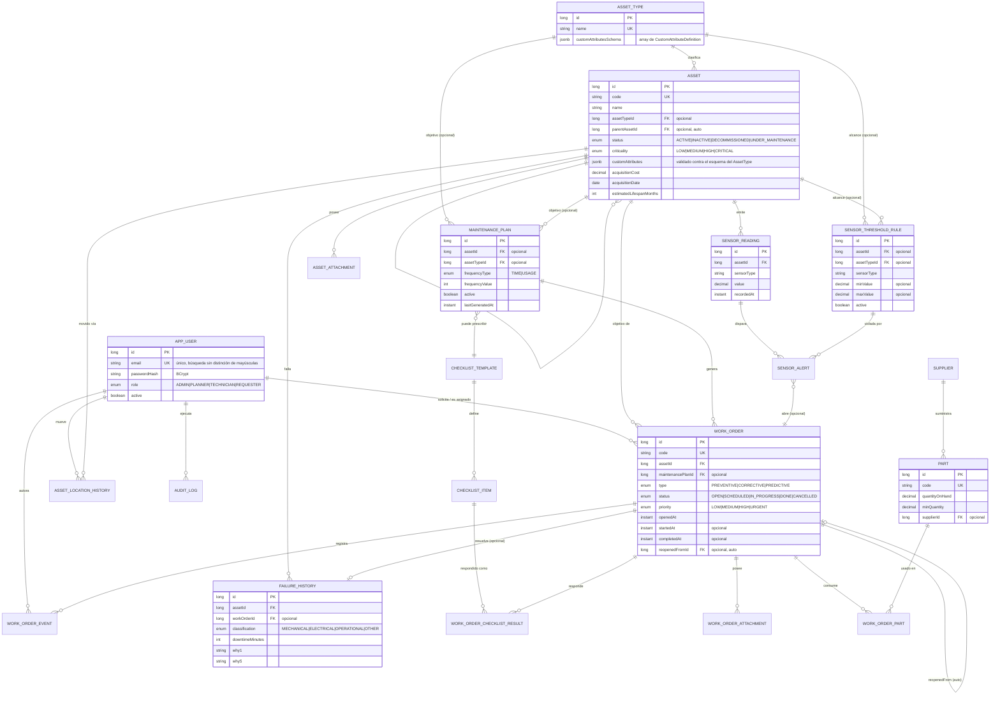
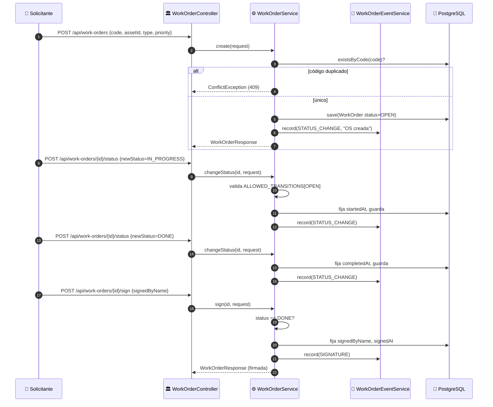
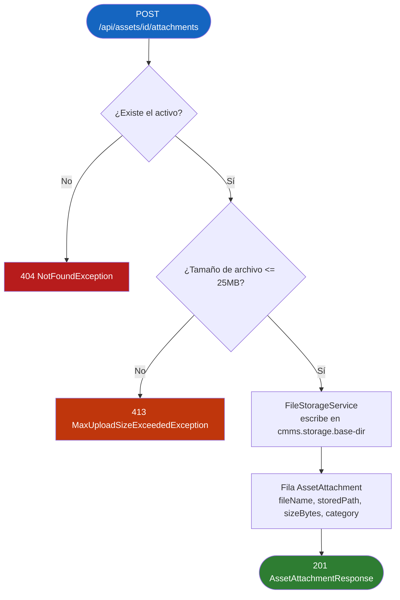
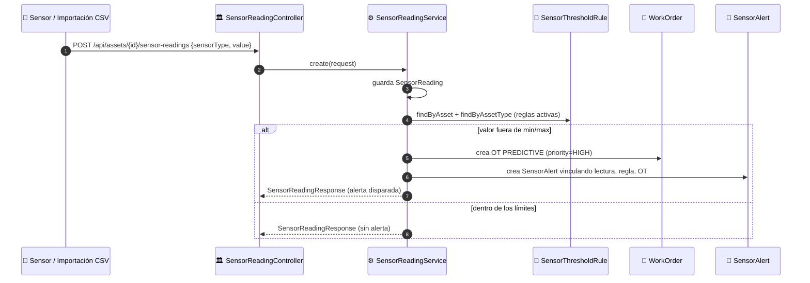
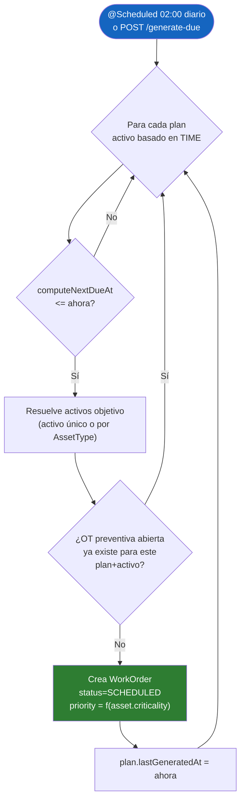
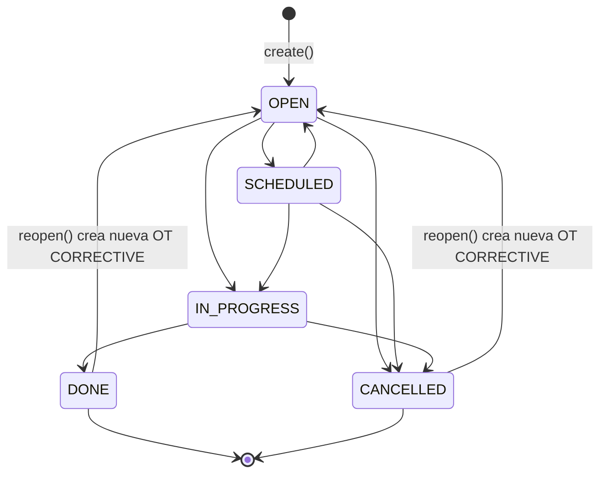
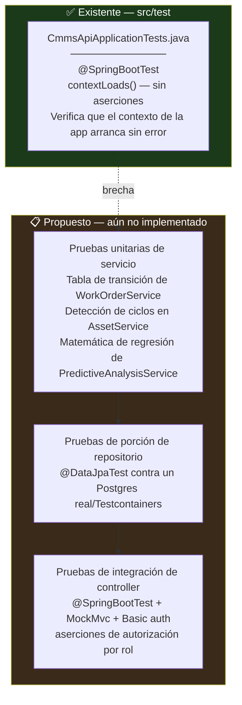

<div align="center">

**🌐 Choose Language / Selecione o Idioma / Elija el Idioma**

[](README.md)&nbsp;&nbsp;&nbsp;[](README_PT.md)&nbsp;&nbsp;&nbsp;[](README_ES.md)

</div>

---

<div align="center">

```
 ██████╗███╗   ███╗███╗   ███╗███████╗██╗     ██╗ ██████╗ ██╗  ██╗████████╗
██╔════╝████╗ ████║████╗ ████║██╔════╝██║     ██║██╔════╝ ██║  ██║╚══██╔══╝
██║     ██╔████╔██║██╔████╔██║███████╗██║     ██║██║  ███╗███████║   ██║
██║     ██║╚██╔╝██║██║╚██╔╝██║╚════██║██║     ██║██║   ██║██╔══██║   ██║
╚██████╗██║ ╚═╝ ██║██║ ╚═╝ ██║███████║███████╗██║╚██████╔╝██║  ██║   ██║
 ╚═════╝╚═╝     ╚═╝╚═╝     ╚═╝╚══════╝╚══════╝╚═╝ ╚═════╝ ╚═╝  ╚═╝   ╚═╝
    Sistema Computarizado de Gestion de Mantenimiento — API en Spring Boot
```

---

[](https://openjdk.org/)
[](https://spring.io/projects/spring-boot)
[](https://www.postgresql.org/)
[](https://flywaydb.org/)
[](https://spring.io/projects/spring-security)
[](https://pdfbox.apache.org/)
[](https://github.com/zxing/zxing)
[](https://maven.apache.org/)

<br/>

> **Un backend de Sistema Computarizado de Gestion de Mantenimiento (CMMS) autoalojado**
> que cubre activos, ordenes de trabajo, planificacion preventiva, alertas predictivas por sensor y trazabilidad total, sin dependencias externas de nube.

<br/>


</div>

---

## 📑 Tabla de Contenidos

<details>
<summary>▶️ <strong>Haga clic para expandir / contraer esta sección</strong></summary>

<table>
<tr>
<td valign="top" width="50%">

**🏗️ Sistema**
- [Visión General](#-visión-general)
- [Arquitectura del Sistema](#-arquitectura-del-sistema)
- [Stack Tecnológico](#-stack-tecnológico)
- [Patrones de Diseño Aplicados](#-patrones-de-diseño-aplicados)
- [Estructura del Proyecto](#-estructura-del-proyecto)

**📦 Módulos**
- [AppUser & Autenticación](#-appuser--authcontroller--identidad-y-roles)
- [Asset & AssetType](#-asset--assettype--el-registro-jerárquico-de-activos)
- [Adjuntos de Activo & Historial de Ubicación](#-assetattachment--assetlocationhistory--evidencias-y-trazabilidad)
- [Orden de Trabajo](#-workorder--la-unidad-central-de-ejecución)
- [Submódulos de la OT](#-workorderevent--workorderchecklistresult--workorderpart--workorderattachment)
- [Plan de Mantenimiento & Planificador](#-maintenanceplan--maintenanceschedulerservice--motor-preventivo)
- [Lectura de Sensor, Regla de Umbral & Análisis Predictivo](#-sensorreading--sensorthresholdrule--sensoralert--predictiveanalysisservice)
- [Historial de Fallas (RCA)](#-failurehistory--análisis-de-causa-raíz)
- [Repuesto & Proveedor](#-part--supplier--inventario)
- [Reportes, Backup, QR & Auditoría](#-reportservice--backupservice--qrcodeservice--auditlogservice)

</td>
<td valign="top" width="50%">

**💼 Negocio**
- [Reglas de Negocio](#-reglas-de-negocio)
- [Requisitos Funcionales](#-requisitos-funcionales)
- [Requisitos No Funcionales](#-requisitos-no-funcionales)

**📐 Diseño**
- [Modelo de Datos](#-modelo-de-datos)
- [Flujos del Sistema](#-flujos-del-sistema)
- [Ciclo de Vida de la Orden de Trabajo](#flujo-de-ciclo-de-vida-de-la-orden-de-trabajo)
- [Carga de Adjunto de Activo](#flujo-de-carga-de-adjunto-de-activo)
- [Alerta de Umbral de Sensor](#flujo-de-alerta-de-umbral-de-sensor)
- [Planificación Preventiva](#flujo-de-planificación-de-mantenimiento-preventivo)
- [Máquina de Estados de la OT](#máquina-de-estados-de-la-orden-de-trabajo)

**🔐 Seguridad & Operación**
- [Seguridad](#-seguridad)
- [Instalación & Ejecución](#-instalación--ejecución)
- [Pruebas Automatizadas](#-pruebas-automatizadas)
- [Métricas & Monitoreo](#-métricas--monitoreo)
- [Limitaciones Conocidas](#-limitaciones-conocidas)

</td>
</tr>
</table>

---

</details>

## 🌟 Visión General

<details>
<summary>▶️ <strong>Haga clic para expandir / contraer esta sección</strong></summary>

**CMMSlight** es un Sistema Computarizado de Gestion de Mantenimiento (CMMS) autoalojado, construido con **Spring Boot 4.1** sobre **Java 21**. Vive en el modulo Maven `cmms-api`, respaldado por **PostgreSQL** y versionado con **Flyway**, y expone una API REST consumida por un frontend React complementario en `cmms-web`. El proyecto modela la realidad operativa de un departamento de mantenimiento industrial: un registro jerarquico de activos, ordenes de trabajo que recorren un ciclo de vida controlado, planes preventivos que generan trabajo automaticamente, lecturas de sensor que pueden disparar mantenimiento predictivo, y una traza de auditoria completa.

El backend es deliberadamente ligero en dependencias de infraestructura: la autenticacion es HTTP Basic local contra una tabla `app_user`, la generacion de PDF usa Apache PDFBox, los codigos QR se renderizan con ZXing, y las copias de seguridad de la base de datos invocan los binarios locales `pg_dump`/`psql`. Nada se delega a un SaaS de terceros. Toda entidad relevante para el cumplimiento (ordenes de trabajo, respuestas de checklist, alertas de sensor) escribe un evento de dominio o una fila de log de auditoria, por lo que el sistema produce su propia traza documental sin necesitar una plataforma externa de logs.

El dominio esta organizado en cinco pilares: **Gestion de Activos** (activos jerarquicos, esquemas de atributos personalizados, etiquetas QR, historial de ubicacion), **Ejecucion de Ordenes de Trabajo** (maquina de estados, asignacion, checklists, consumo de repuestos, OT en PDF, firma digital), **Mantenimiento Preventivo y Predictivo** (planes basados en tiempo/uso con un planificador diario, reglas de umbral de sensor que abren OT predictivas automaticamente, analisis de tendencia por regresion lineal simple), **Inventario** (repuestos, proveedores, alertas de stock minimo) y **Gobernanza** (log de auditoria, autorizacion por rol, backup/restauracion local, reportes en CSV/PDF/QR).

### 🎯 Objetivos del Sistema

| Objetivo | Descripción |
|-----------|-------------|
| 🏭 **Registro Jerárquico de Activos** | Modelar árboles padre/hijo de equipos con esquemas de atributos personalizados por `AssetType` |
| 🧾 **Ciclo de Vida Controlado de la OT** | Imponer una máquina de estados estricta (`OPEN → SCHEDULED → IN_PROGRESS → DONE/CANCELLED`) con historial completo de eventos |
| 🗓️ **Planificación Preventiva Automática** | Generar OT preventivas vencidas diariamente mediante un job `@Scheduled`, sin planificador externo |
| 📡 **Alertas Predictivas por Sensor** | Abrir automáticamente OT `PREDICTIVE` cuando una lectura de sensor sobrepasa un umbral mínimo/máximo configurado |
| 📈 **Análisis de Tendencia Ligero** | Calcular media, desviación estándar, anomalías y una estimación de ruptura de umbral por regresión lineal por sensor |
| 🧰 **Consumo Trazable de Repuestos** | Vincular repuestos usados por OT y rastrear el historial de consumo frente a un proveedor |
| 🔍 **Análisis de Causa Raíz** | Capturar los 5 Porqués y una clasificación de falla por registro de `FailureHistory` |
| 🔐 **Control de Acceso por Rol** | Cuatro roles (`ADMIN`, `PLANNER`, `TECHNICIAN`, `REQUESTER`) aplicados por método HTTP y ruta |
| 🗄️ **Backup y Reportes Locales** | Disparar copias de seguridad `pg_dump`/`psql` y resúmenes diarios en CSV desde la propia API, sin almacenamiento en la nube |
| 🖨️ **Automatización de Documentos** | Generar PDFs de orden de trabajo (PDFBox) y etiquetas QR de activo (ZXing) bajo demanda |

---

</details>

## 🏗️ Arquitectura del Sistema

<details>
<summary>▶️ <strong>Haga clic para expandir / contraer esta sección</strong></summary>

### Diagrama de Módulos



### Capas de Arquitectura



---

</details>

## 🛠️ Stack Tecnológico

<details>
<summary>▶️ <strong>Haga clic para expandir / contraer esta sección</strong></summary>

<table>
<thead>
<tr>
<th>Capa</th>
<th>Tecnología</th>
<th>Versión</th>
<th>Propósito</th>
</tr>
</thead>
<tbody>
<tr>
<td rowspan="2"><strong>🧠 Lenguaje</strong></td>
<td>Java</td>
<td>21</td>
<td><code>java.version</code> en <code>pom.xml</code></td>
</tr>
<tr>
<td>TypeScript</td>
<td>~6.0.2</td>
<td>Frontend complementario (<code>cmms-web</code>), fuera del alcance de este módulo de API</td>
</tr>
<tr>
<td rowspan="2"><strong>🍃 Framework</strong></td>
<td>Spring Boot</td>
<td>4.1.0</td>
<td>POM padre, autoconfiguración, servidor embebido</td>
</tr>
<tr>
<td>Spring MVC</td>
<td><code>spring-boot-starter-webmvc</code></td>
<td>Controllers REST, manejo de errores vía <code>@RestControllerAdvice</code></td>
</tr>
<tr>
<td rowspan="3"><strong>💾 Persistencia</strong></td>
<td>Spring Data JPA / Hibernate</td>
<td><code>spring-boot-starter-data-jpa</code></td>
<td>20 repositorios sobre 20 entidades, <code>ddl-auto=validate</code></td>
</tr>
<tr>
<td>Driver PostgreSQL</td>
<td>ámbito runtime</td>
<td>Conectividad JDBC con <code>jdbc:postgresql://localhost:5432/cmmslight</code></td>
</tr>
<tr>
<td>Flyway</td>
<td><code>flyway-database-postgresql</code></td>
<td>5 migraciones versionadas (<code>V1</code>–<code>V5</code>) en <code>db/migration</code></td>
</tr>
<tr>
<td rowspan="2"><strong>🔐 Seguridad</strong></td>
<td>Spring Security</td>
<td><code>spring-boot-starter-security</code></td>
<td>HTTP Basic, sesiones sin estado, autorización por rol</td>
</tr>
<tr>
<td>BCrypt</td>
<td><code>BCryptPasswordEncoder</code></td>
<td>Hash de contraseña para <code>app_user.password_hash</code></td>
</tr>
<tr>
<td rowspan="2"><strong>✅ Validación</strong></td>
<td>Jakarta Bean Validation</td>
<td><code>spring-boot-starter-validation</code></td>
<td>DTOs con <code>@Valid</code>, manejo de <code>ConstraintViolationException</code></td>
</tr>
<tr>
<td>Excepciones personalizadas</td>
<td><code>ValidationException</code>, <code>ConflictException</code>, <code>NotFoundException</code></td>
<td>Reglas de dominio mapeadas a estado HTTP por el <code>GlobalExceptionHandler</code></td>
</tr>
<tr>
<td rowspan="3"><strong>📄 Documentos / Media</strong></td>
<td>Apache PDFBox</td>
<td>3.0.3</td>
<td><code>WorkOrderPdfService</code> — PDFs imprimibles de orden de trabajo</td>
</tr>
<tr>
<td>ZXing core + javase</td>
<td>3.5.3</td>
<td><code>QrCodeService</code> — PNGs de etiqueta QR de activo</td>
</tr>
<tr>
<td>Jackson Databind</td>
<td>vía BOM de Spring Boot</td>
<td>Serialización JSON, mapeo JSONB (atributos personalizados)</td>
</tr>
<tr>
<td rowspan="2"><strong>📊 Observabilidad</strong></td>
<td>Spring Boot Actuator</td>
<td><code>spring-boot-starter-actuator</code></td>
<td>Expone <code>/actuator/health</code> (permitido sin autenticación)</td>
</tr>
<tr>
<td>Lombok</td>
<td>opcional, excluido del JAR final</td>
<td><code>@Getter</code>/<code>@Setter</code>/<code>@NoArgsConstructor</code> en las entidades</td>
</tr>
<tr>
<td rowspan="2"><strong>🔧 Build</strong></td>
<td>Maven Wrapper</td>
<td><code>mvnw</code> / <code>mvnw.cmd</code></td>
<td>Builds reproducibles sin Maven instalado localmente</td>
</tr>
<tr>
<td>spring-boot-maven-plugin</td>
<td>—</td>
<td>Empaquetado del JAR ejecutable, excluye Lombok</td>
</tr>
<tr>
<td rowspan="1"><strong>🧪 Pruebas</strong></td>
<td>Starters de prueba de Spring Boot</td>
<td>starters de prueba actuator / data-jpa / flyway / validation / webmvc</td>
<td>Dependencias de ámbito de prueba que respaldan <code>@SpringBootTest</code></td>
</tr>
</tbody>
</table>

---

</details>

## 🎨 Patrones de Diseño Aplicados

<details>
<summary>▶️ <strong>Haga clic para expandir / contraer esta sección</strong></summary>

| Patrón | Dónde | Justificación |
|---------|-------|-----------|
| 🧭 **Arquitectura en Capas** | `web` → `service` → `repository` → `domain` | Los controllers permanecen delgados, las reglas de negocio se concentran en servicios `@Transactional` |
| 🔁 **Máquina de Estados** | `WorkOrderService.ALLOWED_TRANSITIONS` (`EnumMap<Status, Set<Status>>` estático) | Garantiza que una OT nunca salte una transición de estado ilegal |
| 📢 **Log de Eventos de Dominio** | `WorkOrderEventService.record(...)`, invocado en casi todo método mutador | Cada cambio de estado, comentario, asignación, firma, respuesta de checklist y uso de repuesto se convierte en una entrada de la línea de tiempo |
| 🗂️ **Repository** | `repository/*Repository extends JpaRepository` | Desacopla los servicios de los detalles de persistencia, habilita métodos de consulta derivados |
| 🏭 **DTO / Mapper** | `dto/*Request` y `dto/*Response` como records, métodos privados `toResponse()` en cada servicio | Las entidades nunca se filtran directamente a través de la frontera REST |
| 🚦 **Guard Clause / Fail Fast** | `NotFoundException`, `ConflictException`, `ValidationException` lanzadas tempranamente en cada método de servicio | Mantiene el camino feliz limpio y centraliza la semántica de error en `GlobalExceptionHandler` |
| ⏰ **Job Programado** | `MaintenanceSchedulerService.generateDueWorkOrdersScheduled()` (`@Scheduled(cron)`), `BackupService.scheduledBackup()` | Los procesos recurrentes de dominio corren dentro del proceso, sin cola/cron externo |
| 🧬 **Strategy vía Switch de Enum** | `MaintenanceSchedulerService.mapCriticalityToPriority`, `WorkOrderChecklistService.validateValue` | El comportamiento se ramifica limpiamente sobre un conjunto cerrado de enum |
| 🧩 **Extensión Guiada por Esquema** | `AssetType.customAttributesSchema` (JSONB) validado contra `Asset.customAttributes` en `AssetService` | Permite agregar campos personalizados por tipo de equipo sin una migración de esquema |
| 🔐 **Facade sobre Proceso del SO** | `BackupService.runProcess(...)` envuelve `pg_dump`/`psql` vía `ProcessBuilder` | El backup/restauración se expone como una API Java simple, ocultando el contrato del proceso externo |

---

</details>

## 📁 Estructura del Proyecto

<details>
<summary>▶️ <strong>Haga clic para expandir / contraer esta sección</strong></summary>

```
CMMSlight/
│
├── 📂 cmms-api/                              # Backend Spring Boot (tema de este README)
│   ├── 📄 pom.xml                            # Build Maven: Spring Boot 4.1.0 parent, Java 21
│   ├── 📄 mvnw / mvnw.cmd                    # Lanzadores del Maven Wrapper
│   ├── 📄 HELP.md                            # Enlaces de referencia generados por Spring Initializr
│   │
│   └── 📂 src/
│       ├── 📂 main/
│       │   ├── 📂 java/com/cmmslight/cmmsapi/
│       │   │   ├── 📄 CmmsApiApplication.java   # Punto de entrada @SpringBootApplication
│       │   │   ├── 📂 domain/                   # 20 clases @Entity (Asset, WorkOrder, SensorReading, ...)
│       │   │   ├── 📂 dto/                      # Records de Request/Response para cada controller
│       │   │   ├── 📂 repository/               # 20 repositorios Spring Data JPA
│       │   │   ├── 📂 service/                  # 24 servicios (reglas de negocio, @Transactional)
│       │   │   │   └── 📂 storage/              # FileStorageService — I/O de adjuntos en disco local
│       │   │   ├── 📂 web/                      # 19 clases @RestController, 99 endpoints en total
│       │   │   ├── 📂 security/                 # SecurityConfig, CmmsUserDetailsService
│       │   │   ├── 📂 config/                   # AppConfig, BackupProperties, FileStorageProperties
│       │   │   └── 📂 exception/                # ApiError, GlobalExceptionHandler, excepciones de dominio
│       │   │
│       │   └── 📂 resources/
│       │       ├── 📄 application.properties    # Config de BD, Flyway, storage, backup, reportes
│       │       └── 📂 db/migration/              # Scripts SQL Flyway V1..V5
│       │
│       └── 📂 test/java/com/cmmslight/cmmsapi/
│           └── 📄 CmmsApiApplicationTests.java  # Única prueba smoke de contexto Spring
│
├── 📂 cmms-web/                               # Frontend React 19 + TypeScript + Vite (módulo separado)
│   ├── 📄 package.json                        # axios, react-router-dom, recharts
│   └── 📂 src/                                # No cubierto en profundidad por este README centrado en el backend
│
├── 📄 README.md                               # 🇺🇸 Inglés (primario)
├── 📄 README_PT.md                            # 🇧🇷 Português
└── 📄 README_ES.md                            # 🇪🇸 Español
```

---

</details>

## 📦 Módulos del Sistema

<details>
<summary>▶️ <strong>Haga clic para expandir / contraer esta sección</strong></summary>

### 👤 AppUser & AuthController — Identidad y Roles

`AppUser` (tabla `app_user`) es el único modelo de identidad: `name`, `email` único, `passwordHash` en BCrypt, uno de cuatro valores de enum `Role` (`ADMIN`, `PLANNER`, `TECHNICIAN`, `REQUESTER`), una bandera `active` y `createdAt`. `CmmsUserDetailsService` lo carga por email para Spring Security, mapeando el rol a una authority `ROLE_*`. `AuthController` expone `GET /api/auth/me`, resolviendo el principal autenticado de vuelta a un `AppUserResponse`.

| Endpoint | Método | Descripción |
|----------|--------|-------------|
| `/api/users` | GET / POST | Lista / crea usuarios (crear, actualizar, eliminar requieren `ADMIN`) |
| `/api/users/{id}` | GET / PUT / DELETE | Obtiene, actualiza o elimina un usuario |
| `/api/auth/me` | GET | Resuelve el principal HTTP Basic actual a su perfil `AppUser` |

---

### 🏭 Asset & AssetType — El Registro Jerárquico de Activos

`Asset` soporta un `parentAsset` autorreferenciado (validado contra ciclos en `AssetService.isDescendant`), un `Status` (`ACTIVE`, `INACTIVE`, `DECOMMISSIONED`, `UNDER_MAINTENANCE`), una `Criticality` (`LOW`…`CRITICAL`, usada para priorizar tanto la cola de OT como la planificación preventiva), campos de garantía y adquisición, y un blob JSONB `customAttributes` validado en escritura contra el `AssetType.customAttributesSchema` del tipo propietario. `AssetService.calculateCurrentDepreciatedValue` ejecuta depreciación lineal a partir de `acquisitionCost`, `acquisitionDate` y `estimatedLifespanMonths`.

| Responsabilidad | Implementación |
|----------------|-----------------|
| Navegación jerárquica | `findRootAssets()`, `findChildren(id)` — `parentAsset IS NULL` / `parentAsset.id = ?` |
| Prevención de ciclos | `applyRequest` rechaza la autopaternidad y los bucles de ancestros antes de guardar |
| Esquema de atributos personalizados | `AssetType.customAttributesSchema` (array JSON de `CustomAttributeDefinition`), validado por tipo (`NUMBER`/`BOOLEAN`/`DATE`/`TEXT`) |
| Etiquetado QR | `GET /api/assets/{id}/qrcode` — `QrCodeService.buildAssetQrContent` + renderizado PNG vía ZXing |
| Movimiento de ubicación | `POST /api/assets/{id}/move` — escribe una fila en `AssetLocationHistory` y actualiza `Asset.location` atómicamente |

---

### 📎 AssetAttachment & AssetLocationHistory — Evidencias y Trazabilidad

`AssetAttachmentService` almacena archivos subidos (manuales, fotos, documentos) vía `FileStorageService` bajo `cmms.storage.base-dir`, limitando las cargas a `spring.servlet.multipart.max-file-size=25MB`. Cada adjunto registra `fileName`, `storedPath`, `contentType`, `sizeBytes` y una `Category` (`MANUAL`, `PHOTO`, `DOCUMENT`, `OTHER`). `AssetLocationHistory` es un libro contable de solo anexado de cada cambio de ubicación, incluyendo quién lo movió y notas en texto libre.

| Endpoint | Método | Descripción |
|----------|--------|-------------|
| `/api/assets/{assetId}/attachments` | GET / POST | Lista / sube (multipart) adjuntos de un activo |
| `/api/assets/{assetId}/attachments/{attachmentId}/download` | GET | Transmite el archivo almacenado con su content-type original |
| `/api/assets/{assetId}/attachments/{attachmentId}` | DELETE | Elimina un adjunto (disco + fila de BD) |
| `/api/assets/{id}/location-history` | GET | Libro contable cronológico completo de movimientos de un activo |

---

### 🧾 WorkOrder — La Unidad Central de Ejecución

`WorkOrder` es la entidad más activa: `Type` (`PREVENTIVE`, `CORRECTIVE`, `PREDICTIVE`), `Status` (`OPEN`, `SCHEDULED`, `IN_PROGRESS`, `DONE`, `CANCELLED`) gobernado por una tabla de transición fija en `WorkOrderService`, `Priority` (`LOW`…`URGENT`), enlaces a `Asset`, un `MaintenancePlan` opcional, usuarios `requestedBy`/`assignedTo`, marcas de tiempo para cada punto del ciclo de vida (`openedAt`, `scheduledAt`, `startedAt`, `completedAt`, `signedAt`), y un `reopenedFrom` autorreferenciado para trazabilidad de retrabajo.

| Responsabilidad | Implementación |
|----------------|-----------------|
| Transiciones de estado | `changeStatus()` valida contra `ALLOWED_TRANSITIONS`, fija `startedAt`/`completedAt` automáticamente |
| Cola por prioridad | `GET /api/work-orders?queue` — ordenado por `priority`, luego `asset.criticality`, luego `openedAt` (desempate FIFO) |
| Firma digital | `sign()` solo se permite cuando `status == DONE`, registra `signedByName` + `signedAt` |
| Retrabajo | `reopen()` solo desde `DONE`/`CANCELLED`, crea una nueva OT `CORRECTIVE` con código `<original>-R<n>` y `reopenedFrom` establecido |
| Exportación a PDF | `GET /api/work-orders/{id}/pdf` — `WorkOrderPdfService` renderiza un documento PDFBox imprimible |
| Protección de eliminación | `delete()` rechaza OT en `IN_PROGRESS`/`DONE` |

---

### 🔗 WorkOrderEvent · WorkOrderChecklistResult · WorkOrderPart · WorkOrderAttachment

Estas cuatro entidades componen la superficie de ejecución de la OT:

| Submódulo | Rol |
|------------|------|
| `WorkOrderEvent` | Fila inmutable de la línea de tiempo (`STATUS_CHANGE`, `COMMENT`, `ASSIGNMENT`, `SIGNATURE`, `CHECKLIST`, `PART_USED`) escrita por `WorkOrderEventService.record(...)`, expuesta como `GET /api/work-orders/{id}/timeline` |
| `WorkOrderChecklistResult` | Respuesta por ítem contra un `ChecklistItem`, validada por tipo en `WorkOrderChecklistService.validateValue` (`YES_NO`/`NUMBER`/`MULTIPLE_CHOICE`/`TEXT`), agregada en un porcentaje de cumplimiento vía `GET .../checklist/compliance` |
| `WorkOrderPart` | Vincula un `Part` y `quantityUsed` a una OT (único por `work_order_id`+`part_id`), alimentando el historial `PartConsumptionResponse` |
| `WorkOrderAttachment` | Mismo modelo de almacenamiento que `AssetAttachment` pero vinculado a una OT, categorizado `BEFORE`/`AFTER`/`OTHER` |

---

### 🗓️ MaintenancePlan & MaintenanceSchedulerService — Motor Preventivo

`MaintenancePlan` apunta a un único `Asset` o a un `AssetType` completo, con un `FrequencyType` de `TIME` (basado en calendario) o `USAGE`. `MaintenanceSchedulerService` corre `@Scheduled(cron = "0 0 2 * * *")` todos los días a las 02:00 (hora del servidor), y la misma lógica se expone manualmente vía `POST /api/maintenance-plans/generate-due`. Para cada plan `TIME` activo cuyo `computeNextDueAt` está vencido, resuelve los activos objetivo, omite cualquiera que ya tenga una OT preventiva abierta para ese plan, y crea una OT `SCHEDULED` cuya `Priority` se deriva de `Asset.criticality`.

| Endpoint | Método | Descripción |
|----------|--------|-------------|
| `/api/maintenance-plans` | GET / POST | Lista / crea planes |
| `/api/maintenance-plans/{id}` | GET / PUT / DELETE | Gestiona un único plan |
| `/api/maintenance-plans/overdue` | GET | Planes vencidos según la fecha calculada |
| `/api/maintenance-plans/calendar` | GET | Planes que vencen dentro de un rango `Instant` |
| `/api/maintenance-plans/generate-due` | POST | Dispara manualmente el mismo job que corre en el cron de las 02:00 |

---

### 📡 SensorReading · SensorThresholdRule · SensorAlert · PredictiveAnalysisService

`SensorReading` registra un valor numérico con marca de tiempo por `Asset` y `sensorType`, creado individualmente o importado en lote vía `POST /api/assets/{assetId}/sensor-readings/import-csv` (columnas `sensorType,value,unit,recordedAt`). Cada guardado ejecuta `SensorReadingService.checkThresholds`, comparando contra filas de `SensorThresholdRule` vinculadas al activo o a su `AssetType`; una violación crea automáticamente una `WorkOrder` `PREDICTIVE` (prioridad `HIGH`) y un `SensorAlert` que vincula la lectura, la regla y la OT generada. `PredictiveAnalysisService.trend()` calcula media, desviación estándar, anomalías de 2-sigma, una pendiente de regresión lineal por mínimos cuadrados, y un `Instant` estimado en el que la tendencia cruzaría el umbral más cercano.

| Endpoint | Método | Descripción |
|----------|--------|-------------|
| `/api/assets/{assetId}/sensor-readings` | GET / POST | Lista / registra lecturas de un activo |
| `/api/assets/{assetId}/sensor-readings/import-csv` | POST | Importación CSV en lote, devuelve filas importadas |
| `/api/assets/{assetId}/sensor-readings/trend` | GET | Media/desviación/anomalías/pendiente/ruptura estimada para un `sensorType` |
| `/api/sensor-threshold-rules` | GET / POST / PUT / DELETE | Gestiona reglas de mín/máx por activo o tipo de activo |

---

### 🧯 FailureHistory — Análisis de Causa Raíz

`FailureHistory` vincula un evento de falla a un `Asset` y, opcionalmente, a la `WorkOrder` que lo resolvió, registrando `failedAt`/`resolvedAt`, `downtimeMinutes`, una `Classification` (`MECHANICAL`, `ELECTRICAL`, `OPERATIONAL`, `OTHER`), y hasta cinco campos de texto libre `why1`..`why5` implementando la técnica de los 5 Porqués. `FailureHistoryService.reliabilityRanking()` y `reliabilityForAsset()` alimentan `AssetReliabilityStats`, agregando el conteo de fallas y el tiempo de inactividad por activo.

| Endpoint | Método | Descripción |
|----------|--------|-------------|
| `/api/failures` | GET / POST | Lista (opcionalmente filtrado por `assetId`) / registra una falla |
| `/api/failures/{id}` | GET / PUT / DELETE | Gestiona un único registro de falla |
| `/api/failures/reliability/ranking` | GET | Activos clasificados por estadísticas de confiabilidad |
| `/api/failures/reliability/{assetId}` | GET | Estadísticas de confiabilidad de un único activo |

---

### 🔩 Part & Supplier — Inventario

`Part` rastrea `quantityOnHand` y `minQuantity` (ambos `BigDecimal`) con un enlace opcional a `Supplier`; `PartController.belowMinimum()` devuelve los ítems por debajo del punto de reorden. `WorkOrderPartService` deduce/registra el consumo cuando se vinculan repuestos a una OT, y `PartController.consumption(id)` expone el historial de uso por repuesto entre órdenes de trabajo.

| Endpoint | Método | Descripción |
|----------|--------|-------------|
| `/api/parts` | GET / POST | Lista / registra repuestos |
| `/api/parts/{id}` | GET / PUT / DELETE | Gestiona un único repuesto |
| `/api/parts/below-minimum` | GET | Repuestos en o por debajo de `minQuantity` |
| `/api/parts/{id}/consumption` | GET | Historial de consumo de un repuesto |
| `/api/suppliers` | GET / POST / PUT / DELETE | CRUD completo de proveedores |

---

### 🗃️ ReportService · BackupService · QrCodeService · AuditLogService

Cuatro servicios de gobernanza cierran el ciclo: `ReportService` escribe resúmenes diarios en CSV en `cmms.reports.directory` y los lista/descarga; `BackupService` invoca `pg_dump`/`psql` (configurado vía `BackupProperties`) hacia `cmms.backup.directory`, también ejecutable en un job semanal `@Scheduled(cron = "0 0 3 * * SUN")`; `QrCodeService` renderiza PNGs de QR de activo con ZXing; `AuditLogService` registra acciones `CREATE`/`UPDATE`/`DELETE` con una cadena `details` para mutaciones de `Asset` y `WorkOrder`, consultable por entidad.

| Endpoint | Método | Descripción |
|----------|--------|-------------|
| `/api/reports` | GET | Lista archivos de reporte generados |
| `/api/reports/daily-summary` | POST | Genera un nuevo resumen diario en CSV |
| `/api/reports/{fileName}/download` | GET | Descarga un archivo de reporte |
| `/api/backups` | GET / POST | Lista backups / ejecuta `pg_dump` ahora |
| `/api/backups/{fileName}/restore` | POST | Restaura desde un archivo de backup nombrado (protegido contra path traversal) |
| `/api/audit-logs` | GET | Lista todo, o filtra por `entityName` + `entityId` |

---

</details>

## 💼 Reglas de Negocio

<details>
<summary>▶️ <strong>Haga clic para expandir / contraer esta sección</strong></summary>

### 🧾 Reglas del Ciclo de Vida de la OT

| # | Regla | Aplicación |
|---|------|-------------|
| RN-01 | Un estado de OT solo puede moverse a lo largo de una transición permitida | Mapa estático `WorkOrderService.ALLOWED_TRANSITIONS`, `ValidationException` en caso contrario |
| RN-02 | `DONE` y `CANCELLED` son terminales, no se permite ninguna transición adicional | `EnumSet` vacío para ambos en el mapa de transiciones |
| RN-03 | `startedAt` se fija exactamente una vez, la primera vez que el estado se vuelve `IN_PROGRESS` | Guardia `if (entity.getStartedAt() == null)` en `changeStatus()` |
| RN-04 | `completedAt` se marca cuando el estado se vuelve `DONE` | Fijado incondicionalmente en `changeStatus()` |
| RN-05 | Una OT no puede eliminarse mientras está `IN_PROGRESS` o `DONE` | `ConflictException` en `WorkOrderService.delete()` |
| RN-06 | Solo una OT `DONE` puede firmarse digitalmente | `ValidationException` en `sign()` si el estado es diferente |
| RN-07 | Solo las OT `DONE` o `CANCELLED` pueden reabrirse, y reabrir siempre crea una nueva OT `CORRECTIVE` | Guardia `ValidationException` más código de retrabajo `<original>-R<n>` en `reopen()` |
| RN-08 | El código de la OT debe ser único | `ConflictException` en `code` duplicado en `create()`/`update()` |

### 🏭 Reglas de Activos

| # | Regla | Aplicación |
|---|------|-------------|
| RN-09 | Un activo no puede ser su propio padre | `ValidationException` en `AssetService.applyRequest` cuando `parentAssetId == currentId` |
| RN-10 | Una jerarquía de activos no puede contener un ciclo | `isDescendant()` recorre la cadena de ancestros antes de aceptar un nuevo padre |
| RN-11 | Un activo con activos hijos existentes no puede eliminarse | `ConflictException` en `AssetService.delete()` |
| RN-12 | Los valores de atributos personalizados se validan contra el esquema del `AssetType` propietario, incluyendo obligatoriedad y tipo (`NUMBER`/`BOOLEAN`/`DATE`/`TEXT`) | `validateAndSerializeCustomAttributes()` / `validateAttributeType()` |
| RN-13 | Cambiar el campo `location` de un activo siempre escribe una entrada en `AssetLocationHistory` | `recordLocationHistory()` invocado en la creación (si location está presente) y en cada actualización donde location cambió |
| RN-14 | El código del activo debe ser único | `ConflictException` en `code` duplicado |

### 📡 Reglas Predictivas y Preventivas

| # | Regla | Aplicación |
|---|------|-------------|
| RN-15 | Una lectura de sensor fuera del `minValue`/`maxValue` de la regla crea automáticamente una OT `PREDICTIVE` y un `SensorAlert` | `SensorReadingService.checkThresholds()` / `triggerAlert()` |
| RN-16 | Las reglas de umbral aplican tanto a nivel de activo específico como de tipo de activo, ambas se verifican | `checkThresholds()` combina reglas activas a nivel de activo y de tipo de activo |
| RN-17 | Una OT preventiva solo se genera cuando el plan está vencido y no existe ya una OT abierta para ese par plan/activo | Guardia `MaintenanceSchedulerService.hasOpenPreventiveWorkOrder()` |
| RN-18 | Un ítem de checklist obligatorio no puede quedar sin responder, y el formato de la respuesta debe coincidir con el tipo de ítem | `WorkOrderChecklistService.validateValue()` |

---

</details>

## ✅ Requisitos Funcionales

<details>
<summary>▶️ <strong>Haga clic para expandir / contraer esta sección</strong></summary>

| ID | Requisito | Prioridad | Estado |
|----|-------------|----------|--------|
| **RF-01** | El sistema debe mantener un registro jerárquico de activos con relaciones padre/hijo | 🔴 Alta | ✅ Implementado |
| **RF-02** | El sistema debe permitir esquemas de atributos personalizados por tipo de activo, validados en la escritura | 🟡 Media | ✅ Implementado |
| **RF-03** | El sistema debe generar un código QR escaneable por activo | 🟢 Baja | ✅ Implementado |
| **RF-04** | El sistema debe rastrear cambios de ubicación de activo en un historial de solo anexado | 🟡 Media | ✅ Implementado |
| **RF-05** | El sistema debe soportar adjuntos de archivo para activos y órdenes de trabajo | 🟡 Media | ✅ Implementado |
| **RF-06** | El sistema debe imponer un ciclo de vida controlado de estado para órdenes de trabajo | 🔴 Alta | ✅ Implementado |
| **RF-07** | El sistema debe encolar OT abiertas ordenadas por prioridad y criticidad del activo | 🔴 Alta | ✅ Implementado |
| **RF-08** | El sistema debe registrar una línea de tiempo completa de eventos por OT | 🔴 Alta | ✅ Implementado |
| **RF-09** | El sistema debe generar un PDF imprimible por orden de trabajo | 🟡 Media | ✅ Implementado |
| **RF-10** | El sistema debe soportar firma digital de órdenes de trabajo completadas | 🟡 Media | ✅ Implementado |
| **RF-11** | El sistema debe permitir reabrir una OT completada o cancelada como retrabajo | 🟡 Media | ✅ Implementado |
| **RF-12** | El sistema debe soportar plantillas de checklist vinculables a OT, con respuestas de cumplimiento por ítem | 🔴 Alta | ✅ Implementado |
| **RF-13** | El sistema debe calcular un porcentaje de cumplimiento de checklist por OT | 🟡 Media | ✅ Implementado |
| **RF-14** | El sistema debe rastrear repuestos consumidos por OT y exponer el historial de consumo | 🟡 Media | ✅ Implementado |
| **RF-15** | El sistema debe generar órdenes de trabajo preventivas automáticamente a partir de planes basados en tiempo | 🔴 Alta | ✅ Implementado |
| **RF-16** | El sistema debe permitir disparar manualmente el job de generación preventiva | 🟢 Baja | ✅ Implementado |
| **RF-17** | El sistema debe registrar lecturas de sensor por activo, individualmente o vía importación CSV | 🟡 Media | ✅ Implementado |
| **RF-18** | El sistema debe generar automáticamente OT predictivas cuando una lectura de sensor sobrepasa una regla de umbral | 🔴 Alta | ✅ Implementado |
| **RF-19** | El sistema debe calcular estadísticas básicas de tendencia (media, desviación estándar, anomalías, pendiente de regresión) por sensor | 🟡 Media | ✅ Implementado |
| **RF-20** | El sistema debe rastrear historial de fallas con campos de causa raíz de los 5 Porqués y un ranking de confiabilidad | 🟡 Media | ✅ Implementado |
| **RF-21** | El sistema debe gestionar repuestos y proveedores, señalando el stock por debajo del mínimo | 🟡 Media | ✅ Implementado |
| **RF-22** | El sistema debe registrar una entrada de log de auditoría para acciones de crear/actualizar/eliminar en activos y OT | 🔴 Alta | ✅ Implementado |
| **RF-23** | El sistema debe soportar backup y restauración local de la base de datos vía `pg_dump`/`psql` | 🟡 Media | ✅ Implementado |
| **RF-24** | El sistema debe generar reportes de resumen diario en CSV | 🟢 Baja | ✅ Implementado |
| **RF-25** | El sistema debe autenticar usuarios e imponer control de acceso por rol en cada endpoint | 🔴 Alta | ✅ Implementado |

---

</details>

## ⚡ Requisitos No Funcionales

<details>
<summary>▶️ <strong>Haga clic para expandir / contraer esta sección</strong></summary>

| ID | Categoría | Requisito | Objetivo |
|----|----------|-------------|--------|
| **RNF-01** | ⚡ Rendimiento | La importación CSV de sensores procesa filas secuencialmente en una única transacción | Aceptable para los tamaños de lote que un operador carga manualmente |
| **RNF-02** | 💾 Integridad de Datos | Los cambios de esquema están versionados y se aplican automáticamente al arrancar | `spring.flyway.enabled=true`, `ddl-auto=validate` (Hibernate nunca altera el esquema automáticamente) |
| **RNF-03** | 🔐 Seguridad | Las contraseñas nunca se almacenan ni se registran en texto plano | `BCryptPasswordEncoder` |
| **RNF-04** | 🔐 Seguridad | Las sesiones son sin estado; no hay estado de sesión en el servidor | `SessionCreationPolicy.STATELESS` |
| **RNF-05** | 📦 Consumo de Recursos | Las cargas de archivo tienen un límite para evitar el uso ilimitado de disco | `spring.servlet.multipart.max-file-size=25MB` / `max-request-size=25MB` |
| **RNF-06** | 🕒 Consistencia | Todas las marcas de tiempo se almacenan y comparan en UTC | `hibernate.jdbc.time_zone=UTC`, columnas de tipo `Instant` |
| **RNF-07** | 🧱 Mantenibilidad | Las reglas de negocio quedan fuera de los controllers, en servicios `@Transactional` | Capas consistentes `web → service → repository` en los 19 controllers |
| **RNF-08** | 🧪 Testabilidad | El contexto de la aplicación debe arrancar limpiamente sin errores de wiring | `CmmsApiApplicationTests.contextLoads()` |
| **RNF-09** | 🔁 Confiabilidad | Los jobs de dominio recurrentes corren sin infraestructura externa | Jobs cron `@Scheduled` dentro del proceso (generación preventiva diaria a las 02:00, backup semanal los domingos a las 03:00) |
| **RNF-10** | 📈 Escalabilidad | El modelo de dominio aísla las consultas de reportes intensivas en lectura de las escrituras transaccionales en la capa de servicio | Métodos de consulta de solo lectura separados de los métodos de escritura `@Transactional` |
| **RNF-11** | 🌍 Portabilidad | El backend no depende de un proveedor de nube específico | Almacenamiento en disco local, `pg_dump`/`psql` locales, PostgreSQL autoalojado |
| **RNF-12** | 🧾 Auditabilidad | Cada mutación de activo y OT deja un registro trazable | `AuditLogService.log(...)` + `WorkOrderEventService.record(...)` |
| **RNF-13** | ♿ Usabilidad | Los errores de la API devuelven una carga útil estructurada y consistente | Record `ApiError` con `timestamp`/`status`/`error`/`message`/`fieldErrors` |
| **RNF-14** | 🔧 Configurabilidad | Las rutas de almacenamiento, backup y reportes son configurables externamente | `FileStorageProperties`, `BackupProperties`, `cmms.reports.directory` en `application.properties` |

---

</details>

## 🗄️ Modelo de Datos

<details>
<summary>▶️ <strong>Haga clic para expandir / contraer esta sección</strong></summary>

### Diagrama Entidad-Relación



### Claves de Configuración (`application.properties`)

| Clave | Por defecto | Propósito |
|-----|---------|---------|
| `spring.datasource.url` | `jdbc:postgresql://localhost:5432/cmmslight` | Conexión al almacén de datos primario |
| `spring.jpa.hibernate.ddl-auto` | `validate` | El esquema es propiedad de Flyway, Hibernate solo lo valida |
| `spring.flyway.locations` | `classpath:db/migration` | Ubicación de los scripts SQL `V1`–`V5` |
| `cmms.storage.base-dir` | `./data/attachments` | Raíz de disco local para adjuntos de activo/OT |
| `cmms.backup.directory` | `./data/backups` | Dónde `pg_dump` escribe los archivos `.sql` |
| `cmms.backup.pg-dump-path` / `cmms.backup.psql-path` | `pg_dump` / `psql` | Binarios externos invocados vía `ProcessBuilder` |
| `cmms.reports.directory` | `./data/reports` | Dónde se escriben los reportes CSV generados |
| `spring.servlet.multipart.max-file-size` | `25MB` | Límite de carga por archivo |

---

</details>

## 🔄 Flujos del Sistema

<details>
<summary>▶️ <strong>Haga clic para expandir / contraer esta sección</strong></summary>

### Flujo de Ciclo de Vida de la Orden de Trabajo



### Flujo de Carga de Adjunto de Activo



### Flujo de Alerta de Umbral de Sensor



### Flujo de Planificación de Mantenimiento Preventivo



### Máquina de Estados de la Orden de Trabajo



---

</details>

## 🔐 Seguridad

<details>
<summary>▶️ <strong>Haga clic para expandir / contraer esta sección</strong></summary>

### Controles Implementados

| Control | Implementación | Efecto |
|---------|---------------|--------|
| 🔐 **Autenticación HTTP Basic** | `SecurityConfig.filterChain` → `.httpBasic(basic -> {})` | Toda solicitud excepto `/actuator/health/**` requiere credenciales |
| 🔑 **Hash de contraseña** | Bean `BCryptPasswordEncoder` | Las contraseñas nunca se almacenan ni comparan en texto plano |
| 🧑‍🤝‍🧑 **Autorización por rol** | Matchers de `authorizeHttpRequests` según `HttpMethod` + patrón de ruta | `ADMIN` para usuarios/logs de auditoría/backups; `ADMIN`/`PLANNER` para escrituras de datos maestros; acceso más amplio para creación de OT |
| 🚫 **Sesiones sin estado** | `SessionCreationPolicy.STATELESS` | Sin superficie de fijación de sesión en el servidor |
| 🧾 **Búsqueda de usuario vía repositorio** | `CmmsUserDetailsService.loadUserByUsername` usa `findByEmailIgnoreCase` | Login sin distinción de mayúsculas por email, bandera `disabled` mapeada de `AppUser.active` |
| ✅ **Mapeo centralizado de errores** | `GlobalExceptionHandler` nunca filtra stack traces, devuelve `ApiError` estructurado | Respuestas 400/404/409/413/500 consistentes |
| 🧭 **Protección contra path traversal en la restauración** | `BackupService.restore` verifica `source.startsWith(backupDir)` | Impide restaurar un archivo arbitrario fuera del directorio de backup |
| 🏥 **Aislamiento del endpoint de salud** | Solo `/actuator/health/**` es `permitAll()` | Ningún otro endpoint del actuator se expone sin autenticación |

### Limitaciones de Seguridad Conocidas

> [!WARNING]
> Los siguientes puntos son inherentes al diseño actual y deben entenderse antes de un uso en producción.

| Limitación | Riesgo | Camino de mitigación |
|------------|------|-----------------|
| 🔓 **Protección CSRF deshabilitada** | `csrf(csrf -> csrf.disable())` — aceptable para una API sin estado consumida por una SPA con Basic auth, pero riesgoso si se agrega autenticación basada en cookies | Reactivar CSRF o migrar a un esquema basado en tokens (JWT) si se introducen cookies de sesión |
| 🔑 **HTTP Basic sobre la red** | Las credenciales se envían en cada solicitud; sin HTTPS por delante viajan en una forma decodificable (Base64) | Terminar TLS en un proxy inverso delante de la API antes de cualquier implementación real |
| 🧵 **Sin limitación de tasa ni protección contra fuerza bruta** | Los intentos de inicio de sesión en `AuthController` no están limitados | Agregar un limitador de tasa (p. ej. Bucket4j) o una política de bloqueo de cuenta |
| 🗄️ **Credenciales de backup leídas de `datasource.password`** | `BackupService` pasa la contraseña de la BD vía la variable de entorno `PGPASSWORD` a un proceso del SO generado | Aceptable para operación local; evitar ejecutar la API como un usuario privilegiado del SO |
| 📄 **Sin autorización a nivel de campo** | Cualquier usuario autenticado puede leer la mayoría de los endpoints GET sin importar el rol | Introducir `@PreAuthorize` a nivel de método donde la visibilidad de lectura deba diferir por rol |
| 🔍 **Sin entrada de log de auditoría para lecturas** | `AuditLogService.log` solo se invoca desde las rutas de escritura (Asset, WorkOrder) | Extender las entidades/acciones auditadas si la auditoría de lecturas se vuelve un requisito |
| 🧬 **Sin política de complejidad de contraseña** | `AppUserService`/`AppUserRequest` no imponen una fortaleza mínima de contraseña más allá de lo que declara Bean Validation | Agregar un validador personalizado de complejidad de contraseña |
| 🗝️ **Granularidad única de rol compartido** | Los roles son amplios (4 en total); sin alcance de propiedad por activo o por OT | Agregar verificaciones de propiedad a nivel de fila si el aislamiento multi-tenant se vuelve necesario |

---

</details>

## 🚀 Instalación & Ejecución

<details>
<summary>▶️ <strong>Haga clic para expandir / contraer esta sección</strong></summary>

### Requisitos Previos

```bash
# JDK Java 21
java -version        # se espera 21+

# PostgreSQL 13+ corriendo localmente, con base de datos y rol acordes a application.properties
# spring.datasource.url=jdbc:postgresql://localhost:5432/cmmslight
# spring.datasource.username=cmmslight / spring.datasource.password=cmmslight
createdb -U postgres cmmslight
psql -U postgres -c "CREATE ROLE cmmslight LOGIN PASSWORD 'cmmslight';"

# pg_dump y psql disponibles en el PATH si se van a ejercitar los endpoints de backup
pg_dump --version
psql --version
```

### Build

```bash
cd cmms-api

# Compila, ejecuta las pruebas, empaqueta el JAR ejecutable
./mvnw clean package

# Solo compila, omite las pruebas
./mvnw clean package -DskipTests

# Ejecuta solo la suite de pruebas
./mvnw test
```

### Ejecución

```bash
# Ejecuta directamente vía el plugin Maven de Spring Boot (aplica migraciones Flyway al arrancar)
./mvnw spring-boot:run

# O ejecuta el JAR empaquetado
java -jar target/cmms-api-0.0.1-SNAPSHOT.jar

# Primer inicio de sesión: sembrado por V5__seed_admin_user.sql
# email: admin@cmmslight.local
curl -u admin@cmmslight.local:<contraseña-semilla> http://localhost:8080/api/auth/me
```

**Frontend (opcional, módulo separado)**

```bash
cd cmms-web
npm install
npm run dev        # servidor de desarrollo de Vite contra la API en el puerto :8080
```

### Objetivos Maven

| Objetivo | Propósito |
|--------|---------|
| `./mvnw clean` | Elimina los artefactos de build en `target/` |
| `./mvnw compile` | Compila solo las fuentes |
| `./mvnw test` | Ejecuta la suite de pruebas (`CmmsApiApplicationTests`) |
| `./mvnw package` | Construye el JAR ejecutable en `target/` |
| `./mvnw spring-boot:run` | Ejecuta la aplicación con el servidor embebido |
| `./mvnw dependency:tree` | Inspecciona el grafo de dependencias resuelto |

### Configuración de Build

| Configuración | Valor | Declarada en |
|---------|-------|-------------|
| `groupId` / `artifactId` | `com.cmmslight` / `cmms-api` | `pom.xml` |
| `version` | `0.0.1-SNAPSHOT` | `pom.xml` |
| POM padre | `spring-boot-starter-parent:4.1.0` | `pom.xml` |
| `java.version` | `21` | `pom.xml` `<properties>` |
| `server.port` | por defecto `8080` (sin sobrescribir) | Valores por defecto de Spring Boot |
| Procesamiento de anotaciones Lombok | conectado a las ejecuciones de `maven-compiler-plugin` | `pom.xml` `<build><plugins>` |

---

</details>

## 🧪 Pruebas Automatizadas

<details>
<summary>▶️ <strong>Haga clic para expandir / contraer esta sección</strong></summary>

> [!IMPORTANT]
> El repositorio actualmente contiene **exactamente una** prueba automatizada: `CmmsApiApplicationTests.contextLoads()`, una prueba smoke de carga de contexto de Spring, sin aserciones propias. No existe cobertura de pruebas de controller, servicio, repositorio ni de integración más allá de confirmar que la aplicación arranca. Cualquier afirmación en contrario sería falsa — esta sección lo declara claramente, según la política del proyecto.

### Arquitectura de Pruebas (estado actual)



| Archivo de prueba | Ubicación | Tipo | Cobertura |
|-----------|----------|------|----------|
| `CmmsApiApplicationTests.java` | `src/test/java/com/cmmslight/cmmsapi/` | `@SpringBootTest` | Solo arranque del contexto de la aplicación |

### Ejecutando las Pruebas

```bash
cd cmms-api

# Ejecuta la suite existente (una prueba)
./mvnw test

# Ubicación del reporte
# target/surefire-reports/com.cmmslight.cmmsapi.CmmsApiApplicationTests.txt
```

### Suite Propuesta (aún no implementada)

| Área | Prueba sugerida | Justificación |
|------|-----------------|-----------|
| `WorkOrderService` | Prueba parametrizada sobre `ALLOWED_TRANSITIONS` afirmando que cada par prohibido lanza `ValidationException` | La máquina de estados es la regla más crítica de seguridad del sistema |
| `AssetService` | Prueba de detección de ciclos: intentar fijar el padre de un activo como uno de sus propios descendientes | `isDescendant()` actualmente no tiene cobertura de regresión automatizada |
| `SensorReadingService` | Prueba de violación de umbral afirmando que se crean una `WorkOrder` `PREDICTIVE` y un `SensorAlert` con valores fuera de rango | Garantía central del mantenimiento predictivo |
| `PredictiveAnalysisService` | Prueba unitaria de `linearRegressionSlope` contra un conjunto de datos conocido con una pendiente calculada a mano | Método puramente matemático, ideal para pruebas unitarias rápidas |
| `MaintenanceSchedulerService` | Prueba de que un plan con una OT abierta existente se omite | Previene la generación duplicada de OT preventivas |
| `GlobalExceptionHandler` | `@WebMvcTest` afirmando que cada tipo de excepción se mapea a su estado HTTP documentado | Estabilidad de contrato para los consumidores de la API |

### Checklist de Aceptación Manual

| # | Escenario | Resultado esperado |
|---|----------|-----------------|
| 1 | `POST /api/work-orders` con un `code` duplicado | `409 Conflict` |
| 2 | `POST /api/work-orders/{id}/status` de `OPEN` directamente a `DONE` | `400 Bad Request` (transición ilegal) |
| 3 | `POST /api/work-orders/{id}/sign` mientras el estado es `OPEN` | `400 Bad Request` |
| 4 | `PUT /api/assets/{id}` fijando `parentAssetId` a un descendiente | `400 Bad Request` (ciclo rechazado) |
| 5 | `DELETE /api/assets/{id}` en un activo con hijos | `409 Conflict` |
| 6 | `POST /api/assets/{id}/sensor-readings` con un valor fuera de una regla configurada | Aparece una nueva OT `PREDICTIVE` en `/api/work-orders?status=OPEN` |
| 7 | `POST /api/maintenance-plans/generate-due` dos veces seguidas | La segunda llamada genera 0 (guardia de ya-abierta) |
| 8 | Inicio de sesión con contraseña incorrecta | `401 Unauthorized` |
| 9 | `POST /api/assets` con rol `REQUESTER` | `403 Forbidden` |
| 10 | `GET /api/work-orders/{id}/pdf` | Descarga un documento PDF válido |

---

</details>

## 📊 Métricas & Monitoreo

<details>
<summary>▶️ <strong>Haga clic para expandir / contraer esta sección</strong></summary>

### Métricas del Código

| Métrica | Valor |
|--------|-------|
| Entidades JPA (`domain/`) | 20 |
| Controllers REST (`web/`) | 19 |
| Total de endpoints REST (métodos `@*Mapping`) | 99 |
| Servicios (`service/` + `service/storage/`) | 24 |
| Repositorios Spring Data | 20 |
| Records DTO (`dto/`) | ~40 (pares Request/Response) |
| Excepciones de dominio personalizadas | 3 (`NotFoundException`, `ConflictException`, `ValidationException`) |
| Migraciones Flyway | 5 (`V1`–`V5`) |
| Archivos de prueba automatizada | 1 (solo smoke de carga de contexto) |
| Jobs programados | 2 (`@Scheduled` — generación preventiva diaria a las 02:00, backup semanal los domingos a las 03:00) |

### Señales en Tiempo de Ejecución

| Señal | Fuente | Dónde observar |
|--------|--------|------------------|
| Salud de la aplicación | Spring Boot Actuator | `GET /actuator/health` (sin autenticación) |
| Ejecuciones de generación preventiva | `MaintenanceSchedulerService` | Filas de `WorkOrderEvent` con el mensaje "OS gerada automaticamente pelo motor de manutencao preventiva" |
| Alertas predictivas | `SensorReadingService.triggerAlert` | Tabla `SensorAlert`, `WorkOrder` vinculada con `type=PREDICTIVE` |
| Traza de auditoría | `AuditLogService` | `GET /api/audit-logs?entityName=Asset&entityId={id}` |
| Historial de backup | `BackupService.listBackups()` | `GET /api/backups`, archivos en `cmms.backup.directory` |

### Comandos de Diagnóstico Útiles

```bash
# Sigue los logs de la aplicación (stdout, al ejecutar vía mvnw/java -jar)
./mvnw spring-boot:run 2>&1 | tee cmms-api.log

# Verifica el endpoint de salud del actuator
curl http://localhost:8080/actuator/health

# Inspecciona la tabla de historial de migraciones de Flyway
psql -U cmmslight -d cmmslight -c "SELECT version, description, success FROM flyway_schema_history ORDER BY installed_rank;"

# Lista los archivos de backup generados en disco
ls -la cmms-api/data/backups/

# Cuenta las órdenes de trabajo abiertas directamente en la base de datos
psql -U cmmslight -d cmmslight -c "SELECT status, count(*) FROM work_order GROUP BY status;"
```

### Códigos de Respuesta / Estado Estandarizados

| Código | Significado | Origen |
|------|---------|--------|
| `200 OK` | GET/PUT/POST exitoso que devuelve un cuerpo | Mapeo por defecto de Spring MVC |
| `201 Created` | Creación de recurso exitosa | `@ResponseStatus(HttpStatus.CREATED)` en los endpoints de creación |
| `204 No Content` | Eliminación exitosa | `@ResponseStatus(HttpStatus.NO_CONTENT)` en los endpoints de eliminación |
| `400 Bad Request` | `ValidationException`, `MethodArgumentNotValidException`, `ConstraintViolationException` | `GlobalExceptionHandler` |
| `401 Unauthorized` | Credenciales HTTP Basic faltantes o inválidas | Cadena de filtros de Spring Security |
| `403 Forbidden` | Autenticado pero el rol carece de la autoridad requerida | Denegación del matcher `authorizeHttpRequests` |
| `404 Not Found` | `NotFoundException` | `GlobalExceptionHandler` |
| `409 Conflict` | `ConflictException` (código duplicado, eliminación ilegal, estado ilegal) | `GlobalExceptionHandler` |
| `413 Payload Too Large` | `MaxUploadSizeExceededException` | `GlobalExceptionHandler` |
| `500 Internal Server Error` | Cualquier `Exception` no manejada | Catch-all de `GlobalExceptionHandler` |

---

</details>

## ⚠️ Limitaciones Conocidas

<details>
<summary>▶️ <strong>Haga clic para expandir / contraer esta sección</strong></summary>

> [!IMPORTANT]
> CMMSlight es un backend de CMMS funcional y autoalojado, pero no ha sido endurecido para una implementación multi-tenant o expuesta a internet en producción. Los puntos siguientes son brechas honestas, fundamentadas en el código fuente, no especulación.

| Categoría | Problema | Estado |
|----------|-------|--------|
| 🧪 **Cobertura de pruebas** | Solo existe una prueba smoke de carga de contexto; sin pruebas unitarias, de porción ni de integración | ⚠️ Abierto — ver la Suite Propuesta en Pruebas Automatizadas |
| 🔐 **CSRF deshabilitado** | `SecurityConfig` deshabilita la protección CSRF por completo | ➕ Intencional para una API sin estado con Basic auth, revisitar si se agrega autenticación por cookie |
| 🔑 **Solo HTTP Basic** | Sin flujo JWT/OAuth2/refresh-token; las credenciales se envían en cada llamada | ⚠️ Abierto — aceptable detrás de TLS, pero no existe expiración ni revocación de token |
| 🧵 **Sin limitación de tasa** | Los endpoints de autenticación no están limitados contra fuerza bruta | ⚠️ Abierto |
| 📦 **Sin paginación** | Todos los endpoints tipo `findAll()` devuelven la tabla completa como una `List` | ⚠️ Abierto — no escalará con gracia a tablas de activos/OT muy grandes |
| 🌐 **No se encontró configuración de CORS** | `SecurityConfig` no declara un `CorsConfigurationSource` | ⚠️ Abierto — el frontend `cmms-web` probablemente necesita una lista de permitidos explícita en una implementación que no sea same-origin |
| 🧾 **Licencia sin definir** | `pom.xml` tiene un bloque `<licenses><license/></licenses>` vacío y no existe un archivo `LICENSE` en la raíz del repositorio | ⚠️ Abierto |
| 🐳 **Sin artefactos de contenedor** | No se encontró ningún `Dockerfile` ni `docker-compose.yml` para `cmms-api` ni `cmms-web` | ⚠️ Abierto — la implementación actualmente asume un host JVM + PostgreSQL provisionado manualmente |
| 🧮 **Los planes de mantenimiento basados en uso están modelados pero no programados** | `MaintenancePlan.FrequencyType.USAGE` existe como valor de enum, pero `MaintenanceSchedulerService` solo procesa planes `TIME` | ⚠️ Abierto — el disparo basado en uso (p. ej. horas de operación derivadas de sensor) no está implementado |
| 🗄️ **Backup/restauración asume acceso local confiable del SO** | `pg_dump`/`psql` corren como procesos externos con los mismos privilegios de SO que la API | ➕ Intencional para una implementación autoalojada |

> [!TIP]
> La mejora de mayor valor aislado es agregar **paginación a los endpoints de listado** (`Pageable` + respuestas `Page<T>` en `AssetController`, `WorkOrderController`, `SensorReadingController`, etc.), ya que cada listado hoy carga la tabla completa en memoria, y cada consumidor posterior (frontend, reportes, consultas de auditoría) chocará contra ese techo primero conforme los datos crezcan.

</details>

---

<div align="center">

---

### 🔧 CMMSlight

*Un backend, toda la historia de cada activo — desde la adquisición hasta la depreciación y la última orden de trabajo.*

[](https://openjdk.org/)
[](https://spring.io/projects/spring-boot)
[](https://www.postgresql.org/)
[]()

<br/>

```
"El mantenimiento aplazado es una parada anunciada —
 el registro de cada activo debe sobrevivir a la memoria de cualquier técnico."
```

</div>
</content>
