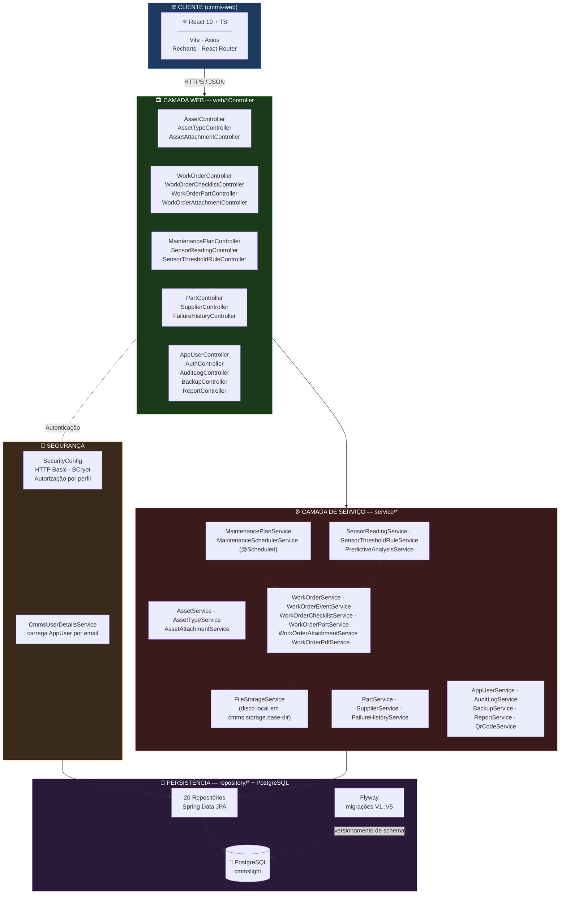
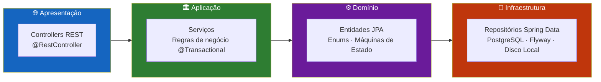
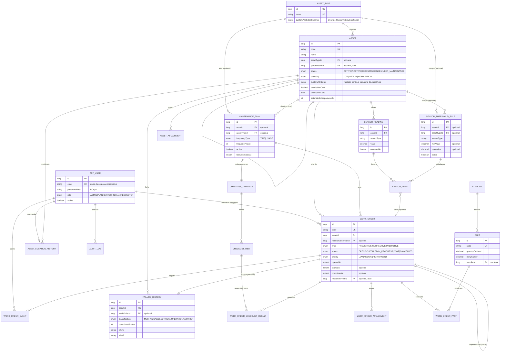
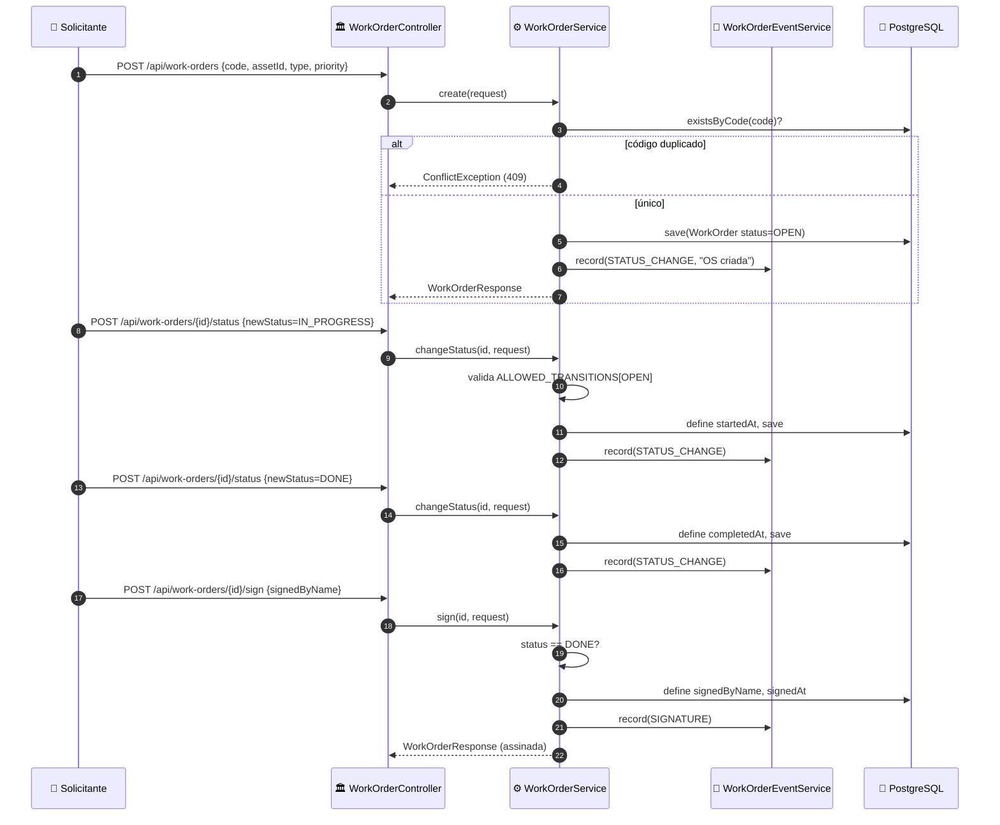
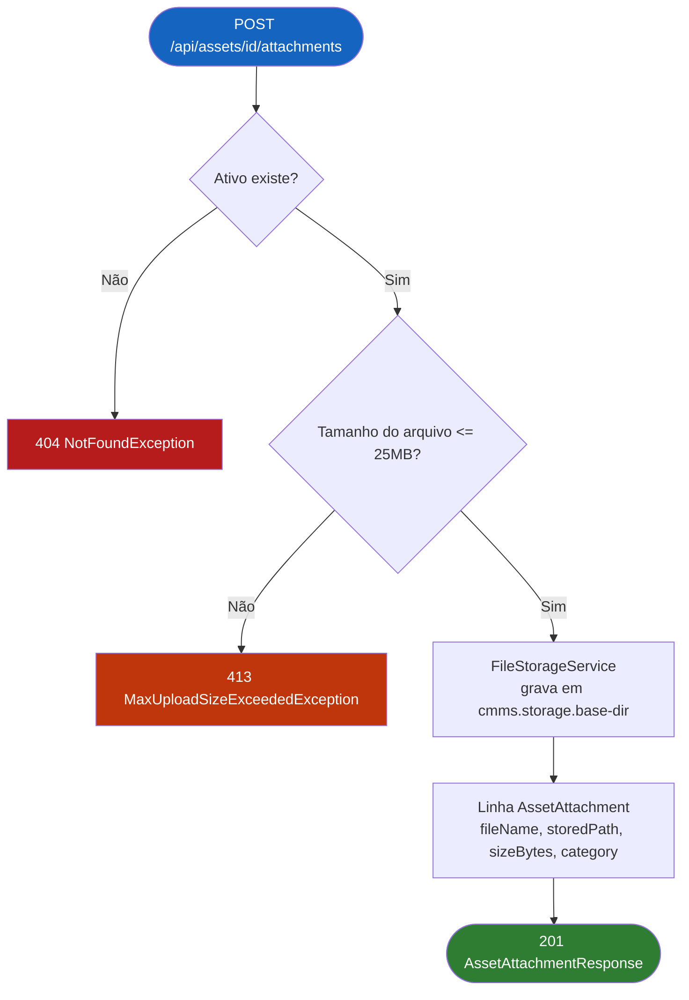
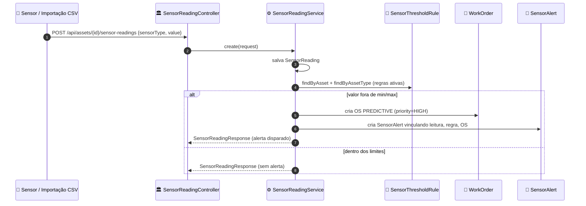
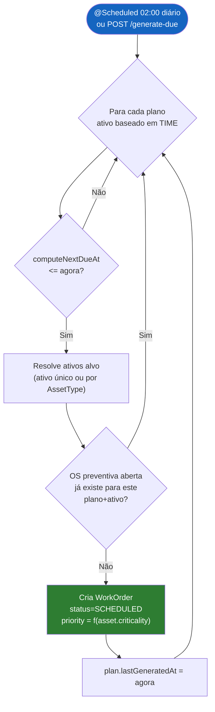
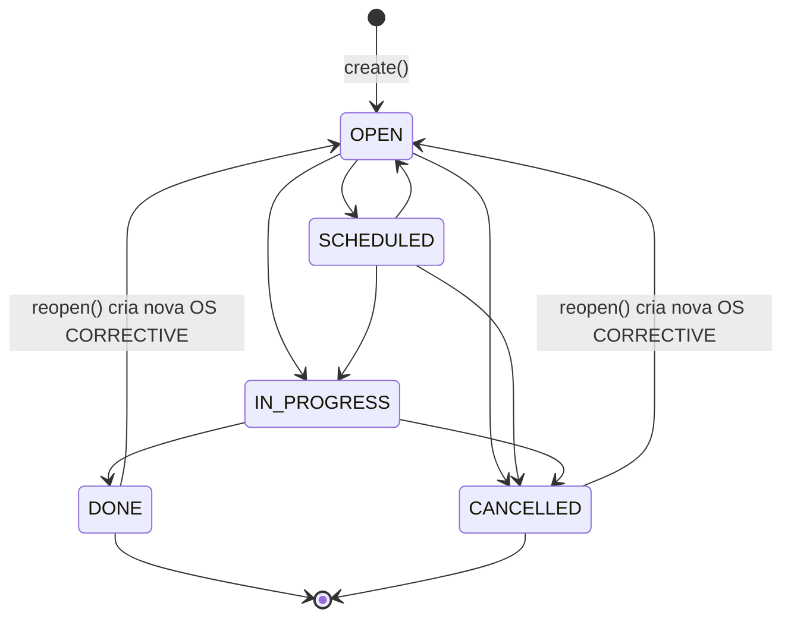
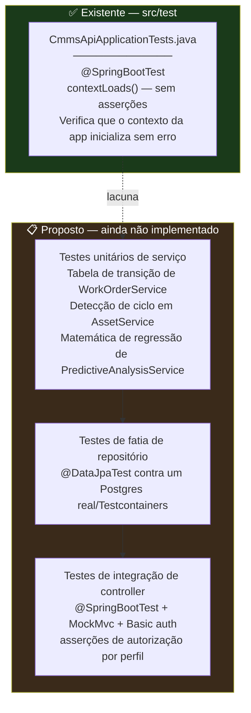

<div align="center">

**🌐 Choose Language / Selecione o Idioma / Elija el Idioma**

[](README.md)&nbsp;&nbsp;&nbsp;[](README_PT.md)&nbsp;&nbsp;&nbsp;[](README_ES.md)

</div>

---

<div align="center">

```
 ██████╗███╗   ███╗███╗   ███╗███████╗██╗     ██╗ ██████╗ ██╗  ██╗████████╗
██╔════╝████╗ ████║████╗ ████║██╔════╝██║     ██║██╔════╝ ██║  ██║╚══██╔══╝
██║     ██╔████╔██║██╔████╔██║███████╗██║     ██║██║  ███╗███████║   ██║
██║     ██║╚██╔╝██║██║╚██╔╝██║╚════██║██║     ██║██║   ██║██╔══██║   ██║
╚██████╗██║ ╚═╝ ██║██║ ╚═╝ ██║███████║███████╗██║╚██████╔╝██║  ██║   ██║
 ╚═════╝╚═╝     ╚═╝╚═╝     ╚═╝╚══════╝╚══════╝╚═╝ ╚═════╝ ╚═╝  ╚═╝   ╚═╝
   Sistema Computadorizado de Gestao da Manutencao — API em Spring Boot
```

---

[](https://openjdk.org/)
[](https://spring.io/projects/spring-boot)
[](https://www.postgresql.org/)
[](https://flywaydb.org/)
[](https://spring.io/projects/spring-security)
[](https://pdfbox.apache.org/)
[](https://github.com/zxing/zxing)
[](https://maven.apache.org/)

<br/>

> **Um backend de Sistema Computadorizado de Gestao da Manutencao (CMMS) auto-hospedado**
> cobrindo ativos, ordens de servico, agendamento preventivo, alertas preditivos por sensor e rastreabilidade total, sem dependencias externas de nuvem.

<br/>


</div>

---

## 📑 Índice

<details>
<summary>▶️ <strong>Clique para expandir / recolher esta seção</strong></summary>

<table>
<tr>
<td valign="top" width="50%">

**🏗️ Sistema**
- [Visão Geral](#-visão-geral)
- [Arquitetura do Sistema](#-arquitetura-do-sistema)
- [Stack Tecnológica](#-stack-tecnológica)
- [Padrões de Projeto Aplicados](#-padrões-de-projeto-aplicados)
- [Estrutura do Projeto](#-estrutura-do-projeto)

**📦 Módulos**
- [AppUser & Autenticação](#-appuser--authcontroller--identidade-e-perfis)
- [Asset & AssetType](#-asset--assettype--o-cadastro-hierárquico-de-ativos)
- [Anexos de Ativo & Histórico de Localização](#-assetattachment--assetlocationhistory--evidências-e-rastreabilidade)
- [Ordem de Serviço](#-workorder--a-unidade-central-de-execução)
- [Submódulos da OS](#-workorderevent--workorderchecklistresult--workorderpart--workorderattachment)
- [Plano de Manutenção & Agendador](#-maintenanceplan--maintenanceschedulerservice--motor-preventivo)
- [Leitura de Sensor, Regra de Limite & Análise Preditiva](#-sensorreading--sensorthresholdrule--sensoralert--predictiveanalysisservice)
- [Histórico de Falhas (RCA)](#-failurehistory--análise-de-causa-raiz)
- [Peça & Fornecedor](#-part--supplier--estoque)
- [Relatórios, Backup, QR & Auditoria](#-reportservice--backupservice--qrcodeservice--auditlogservice)

</td>
<td valign="top" width="50%">

**💼 Negócio**
- [Regras de Negócio](#-regras-de-negócio)
- [Requisitos Funcionais](#-requisitos-funcionais)
- [Requisitos Não Funcionais](#-requisitos-não-funcionais)

**📐 Design**
- [Modelo de Dados](#-modelo-de-dados)
- [Fluxos do Sistema](#-fluxos-do-sistema)
- [Ciclo de Vida da Ordem de Serviço](#fluxo-de-ciclo-de-vida-da-ordem-de-serviço)
- [Upload de Anexo de Ativo](#fluxo-de-upload-de-anexo-de-ativo)
- [Alerta de Limite de Sensor](#fluxo-de-alerta-de-limite-de-sensor)
- [Agendamento Preventivo](#fluxo-de-agendamento-de-manutenção-preventiva)
- [Máquina de Estados da OS](#máquina-de-estados-da-ordem-de-serviço)

**🔐 Segurança & Operação**
- [Segurança](#-segurança)
- [Instalação & Execução](#-instalação--execução)
- [Testes Automatizados](#-testes-automatizados)
- [Métricas & Monitoramento](#-métricas--monitoramento)
- [Limitações Conhecidas](#-limitações-conhecidas)

</td>
</tr>
</table>

---

</details>

## 🌟 Visão Geral

<details>
<summary>▶️ <strong>Clique para expandir / recolher esta seção</strong></summary>

**CMMSlight** é um Sistema Computadorizado de Gestao da Manutencao (CMMS) auto-hospedado, construido com **Spring Boot 4.1** sobre **Java 21**. Ele vive no modulo Maven `cmms-api`, apoiado em **PostgreSQL** e versionado com **Flyway**, e expoe uma API REST consumida por um frontend React complementar em `cmms-web`. O projeto modela a realidade operacional de um departamento de manutencao industrial: um cadastro hierarquico de ativos, ordens de servico que percorrem um ciclo de vida controlado, planos preventivos que geram trabalho automaticamente, leituras de sensor que podem disparar manutencao preditiva, e uma trilha de auditoria completa.

O backend e deliberadamente enxuto em dependencias de infraestrutura: a autenticacao e HTTP Basic local contra uma tabela `app_user`, a geracao de PDF usa Apache PDFBox, os QR Codes sao renderizados com ZXing, e os backups do banco chamam os binarios locais `pg_dump`/`psql`. Nada e delegado a um SaaS de terceiros. Toda entidade relevante para conformidade (ordens de servico, respostas de checklist, alertas de sensor) grava um evento de dominio ou uma linha de log de auditoria, entao o sistema produz sua propria trilha de papel sem precisar de uma plataforma externa de logs.

O dominio esta organizado em cinco pilares: **Gestao de Ativos** (ativos hierarquicos, esquemas de atributos customizados, etiquetas QR, historico de localizacao), **Execucao de Ordens de Servico** (maquina de estados, atribuicao, checklists, consumo de pecas, OS em PDF, assinatura digital), **Manutencao Preventiva e Preditiva** (planos baseados em tempo/uso com agendador diario, regras de limite de sensor que abrem OS preditivas automaticamente, analise de tendencia por regressao linear simples), **Estoque** (pecas, fornecedores, alertas de estoque minimo) e **Governanca** (log de auditoria, autorizacao por perfil, backup/restauracao local, relatorios em CSV/PDF/QR).

### 🎯 Objetivos do Sistema

| Objetivo | Descrição |
|-----------|-------------|
| 🏭 **Cadastro Hierárquico de Ativos** | Modelar árvores pai/filho de equipamentos com esquemas de atributos customizados por `AssetType` |
| 🧾 **Ciclo de Vida Controlado da OS** | Impor uma máquina de estados rígida (`OPEN → SCHEDULED → IN_PROGRESS → DONE/CANCELLED`) com histórico completo de eventos |
| 🗓️ **Agendamento Preventivo Automático** | Gerar OS preventivas vencidas diariamente via job `@Scheduled`, sem agendador externo |
| 📡 **Alertas Preditivos por Sensor** | Abrir automaticamente OS `PREDICTIVE` quando uma leitura de sensor ultrapassa um limite mínimo/máximo configurado |
| 📈 **Análise de Tendência Leve** | Calcular média, desvio padrão, anomalias e uma estimativa de ruptura de limite por regressão linear por sensor |
| 🧰 **Consumo Rastreável de Peças** | Vincular peças usadas por OS e acompanhar o histórico de consumo contra um fornecedor |
| 🔍 **Análise de Causa Raiz** | Capturar os 5 Porquês e uma classificação de falha por registro de `FailureHistory` |
| 🔐 **Controle de Acesso por Perfil** | Quatro perfis (`ADMIN`, `PLANNER`, `TECHNICIAN`, `REQUESTER`) aplicados por método HTTP e caminho |
| 🗄️ **Backup e Relatórios Locais** | Disparar backups `pg_dump`/`psql` e resumos diários em CSV a partir da própria API, sem armazenamento em nuvem |
| 🖨️ **Automação de Documentos** | Gerar PDFs de ordem de serviço (PDFBox) e etiquetas QR de ativo (ZXing) sob demanda |

---

</details>

## 🏗️ Arquitetura do Sistema

<details>
<summary>▶️ <strong>Clique para expandir / recolher esta seção</strong></summary>

### Diagrama de Módulos



### Camadas de Arquitetura



---

</details>

## 🛠️ Stack Tecnológica

<details>
<summary>▶️ <strong>Clique para expandir / recolher esta seção</strong></summary>

<table>
<thead>
<tr>
<th>Camada</th>
<th>Tecnologia</th>
<th>Versão</th>
<th>Propósito</th>
</tr>
</thead>
<tbody>
<tr>
<td rowspan="2"><strong>🧠 Linguagem</strong></td>
<td>Java</td>
<td>21</td>
<td><code>java.version</code> no <code>pom.xml</code></td>
</tr>
<tr>
<td>TypeScript</td>
<td>~6.0.2</td>
<td>Frontend complementar (<code>cmms-web</code>), fora do escopo deste módulo de API</td>
</tr>
<tr>
<td rowspan="2"><strong>🍃 Framework</strong></td>
<td>Spring Boot</td>
<td>4.1.0</td>
<td>POM pai, autoconfiguração, servidor embutido</td>
</tr>
<tr>
<td>Spring MVC</td>
<td><code>spring-boot-starter-webmvc</code></td>
<td>Controllers REST, tratamento de erro via <code>@RestControllerAdvice</code></td>
</tr>
<tr>
<td rowspan="3"><strong>💾 Persistência</strong></td>
<td>Spring Data JPA / Hibernate</td>
<td><code>spring-boot-starter-data-jpa</code></td>
<td>20 repositórios sobre 20 entidades, <code>ddl-auto=validate</code></td>
</tr>
<tr>
<td>Driver PostgreSQL</td>
<td>escopo runtime</td>
<td>Conectividade JDBC com <code>jdbc:postgresql://localhost:5432/cmmslight</code></td>
</tr>
<tr>
<td>Flyway</td>
<td><code>flyway-database-postgresql</code></td>
<td>5 migrações versionadas (<code>V1</code>–<code>V5</code>) em <code>db/migration</code></td>
</tr>
<tr>
<td rowspan="2"><strong>🔐 Segurança</strong></td>
<td>Spring Security</td>
<td><code>spring-boot-starter-security</code></td>
<td>HTTP Basic, sessões stateless, autorização por perfil</td>
</tr>
<tr>
<td>BCrypt</td>
<td><code>BCryptPasswordEncoder</code></td>
<td>Hash de senha para <code>app_user.password_hash</code></td>
</tr>
<tr>
<td rowspan="2"><strong>✅ Validação</strong></td>
<td>Jakarta Bean Validation</td>
<td><code>spring-boot-starter-validation</code></td>
<td>DTOs com <code>@Valid</code>, tratamento de <code>ConstraintViolationException</code></td>
</tr>
<tr>
<td>Exceções customizadas</td>
<td><code>ValidationException</code>, <code>ConflictException</code>, <code>NotFoundException</code></td>
<td>Regras de domínio mapeadas para status HTTP pelo <code>GlobalExceptionHandler</code></td>
</tr>
<tr>
<td rowspan="3"><strong>📄 Documentos / Mídia</strong></td>
<td>Apache PDFBox</td>
<td>3.0.3</td>
<td><code>WorkOrderPdfService</code> — PDFs imprimíveis de ordem de serviço</td>
</tr>
<tr>
<td>ZXing core + javase</td>
<td>3.5.3</td>
<td><code>QrCodeService</code> — PNGs de etiqueta QR de ativo</td>
</tr>
<tr>
<td>Jackson Databind</td>
<td>via BOM do Spring Boot</td>
<td>Serialização JSON, mapeamento JSONB (atributos customizados)</td>
</tr>
<tr>
<td rowspan="2"><strong>📊 Observabilidade</strong></td>
<td>Spring Boot Actuator</td>
<td><code>spring-boot-starter-actuator</code></td>
<td>Expõe <code>/actuator/health</code> (permitido sem autenticação)</td>
</tr>
<tr>
<td>Lombok</td>
<td>opcional, excluído do JAR final</td>
<td><code>@Getter</code>/<code>@Setter</code>/<code>@NoArgsConstructor</code> nas entidades</td>
</tr>
<tr>
<td rowspan="2"><strong>🔧 Build</strong></td>
<td>Maven Wrapper</td>
<td><code>mvnw</code> / <code>mvnw.cmd</code></td>
<td>Builds reprodutíveis sem Maven instalado localmente</td>
</tr>
<tr>
<td>spring-boot-maven-plugin</td>
<td>—</td>
<td>Empacotamento do JAR executável, exclui Lombok</td>
</tr>
<tr>
<td rowspan="1"><strong>🧪 Testes</strong></td>
<td>Starters de teste do Spring Boot</td>
<td>starters de teste actuator / data-jpa / flyway / validation / webmvc</td>
<td>Dependências de escopo de teste que suportam o <code>@SpringBootTest</code></td>
</tr>
</tbody>
</table>

---

</details>

## 🎨 Padrões de Projeto Aplicados

<details>
<summary>▶️ <strong>Clique para expandir / recolher esta seção</strong></summary>

| Padrão | Onde | Justificativa |
|---------|-------|-----------|
| 🧭 **Arquitetura em Camadas** | `web` → `service` → `repository` → `domain` | Controllers permanecem finos, regras de negócio se concentram em serviços `@Transactional` |
| 🔁 **Máquina de Estados** | `WorkOrderService.ALLOWED_TRANSITIONS` (`EnumMap<Status, Set<Status>>` estático) | Garante que uma OS nunca pule uma transição de status ilegal |
| 📢 **Log de Eventos de Domínio** | `WorkOrderEventService.record(...)`, chamado em quase todo método mutador | Toda mudança de status, comentário, atribuição, assinatura, resposta de checklist e uso de peça vira uma entrada da linha do tempo |
| 🗂️ **Repository** | `repository/*Repository extends JpaRepository` | Desacopla serviços dos detalhes de persistência, habilita métodos de consulta derivados |
| 🏭 **DTO / Mapper** | `dto/*Request` e `dto/*Response` como records, métodos privados `toResponse()` em cada serviço | Entidades nunca vazam diretamente pela fronteira REST |
| 🚦 **Guard Clause / Fail Fast** | `NotFoundException`, `ConflictException`, `ValidationException` lançadas cedo em cada método de serviço | Mantém o caminho feliz enxuto e centraliza a semântica de erro no `GlobalExceptionHandler` |
| ⏰ **Job Agendado** | `MaintenanceSchedulerService.generateDueWorkOrdersScheduled()` (`@Scheduled(cron)`), `BackupService.scheduledBackup()` | Processos recorrentes de domínio rodam in-process, sem fila/cron externo |
| 🧬 **Strategy via Switch de Enum** | `MaintenanceSchedulerService.mapCriticalityToPriority`, `WorkOrderChecklistService.validateValue` | O comportamento se ramifica de forma limpa sobre um conjunto fechado de enum |
| 🧩 **Extensão Orientada a Esquema** | `AssetType.customAttributesSchema` (JSONB) validado contra `Asset.customAttributes` em `AssetService` | Permite adicionar campos customizados por tipo de equipamento sem migração de schema |
| 🔐 **Facade sobre Processo do SO** | `BackupService.runProcess(...)` encapsula `pg_dump`/`psql` via `ProcessBuilder` | Backup/restauração é exposto como uma API Java simples, escondendo o contrato do processo externo |

---

</details>

## 📁 Estrutura do Projeto

<details>
<summary>▶️ <strong>Clique para expandir / recolher esta seção</strong></summary>

```
CMMSlight/
│
├── 📂 cmms-api/                              # Backend Spring Boot (assunto deste README)
│   ├── 📄 pom.xml                            # Build Maven: Spring Boot 4.1.0 parent, Java 21
│   ├── 📄 mvnw / mvnw.cmd                    # Lançadores do Maven Wrapper
│   ├── 📄 HELP.md                            # Links de referência gerados pelo Spring Initializr
│   │
│   └── 📂 src/
│       ├── 📂 main/
│       │   ├── 📂 java/com/cmmslight/cmmsapi/
│       │   │   ├── 📄 CmmsApiApplication.java   # Ponto de entrada @SpringBootApplication
│       │   │   ├── 📂 domain/                   # 20 classes @Entity (Asset, WorkOrder, SensorReading, ...)
│       │   │   ├── 📂 dto/                      # Records de Request/Response para cada controller
│       │   │   ├── 📂 repository/               # 20 repositórios Spring Data JPA
│       │   │   ├── 📂 service/                  # 24 serviços (regras de negócio, @Transactional)
│       │   │   │   └── 📂 storage/              # FileStorageService — I/O de anexos em disco local
│       │   │   ├── 📂 web/                      # 19 classes @RestController, 99 endpoints no total
│       │   │   ├── 📂 security/                 # SecurityConfig, CmmsUserDetailsService
│       │   │   ├── 📂 config/                   # AppConfig, BackupProperties, FileStorageProperties
│       │   │   └── 📂 exception/                # ApiError, GlobalExceptionHandler, exceções de domínio
│       │   │
│       │   └── 📂 resources/
│       │       ├── 📄 application.properties    # Config de BD, Flyway, storage, backup, relatórios
│       │       └── 📂 db/migration/              # Scripts SQL Flyway V1..V5
│       │
│       └── 📂 test/java/com/cmmslight/cmmsapi/
│           └── 📄 CmmsApiApplicationTests.java  # Único teste smoke de contexto Spring
│
├── 📂 cmms-web/                               # Frontend React 19 + TypeScript + Vite (módulo separado)
│   ├── 📄 package.json                        # axios, react-router-dom, recharts
│   └── 📂 src/                                # Não coberto em profundidade por este README focado no backend
│
├── 📄 README.md                               # 🇺🇸 Inglês (primário)
├── 📄 README_PT.md                            # 🇧🇷 Português
└── 📄 README_ES.md                            # 🇪🇸 Espanhol
```

---

</details>

## 📦 Módulos do Sistema

<details>
<summary>▶️ <strong>Clique para expandir / recolher esta seção</strong></summary>

### 👤 AppUser & AuthController — Identidade e Perfis

`AppUser` (tabela `app_user`) é o único modelo de identidade: `name`, `email` único, `passwordHash` em BCrypt, um dos quatro valores de enum `Role` (`ADMIN`, `PLANNER`, `TECHNICIAN`, `REQUESTER`), uma flag `active` e `createdAt`. `CmmsUserDetailsService` o carrega por email para o Spring Security, mapeando o perfil para uma authority `ROLE_*`. `AuthController` expõe `GET /api/auth/me`, resolvendo o principal autenticado de volta para um `AppUserResponse`.

| Endpoint | Método | Descrição |
|----------|--------|-------------|
| `/api/users` | GET / POST | Lista / cria usuários (criar, atualizar, excluir exigem `ADMIN`) |
| `/api/users/{id}` | GET / PUT / DELETE | Busca, atualiza ou remove um usuário |
| `/api/auth/me` | GET | Resolve o principal HTTP Basic atual para seu perfil `AppUser` |

---

### 🏭 Asset & AssetType — O Cadastro Hierárquico de Ativos

`Asset` suporta um `parentAsset` auto-referenciado (validado contra ciclos em `AssetService.isDescendant`), um `Status` (`ACTIVE`, `INACTIVE`, `DECOMMISSIONED`, `UNDER_MAINTENANCE`), uma `Criticality` (`LOW`…`CRITICAL`, usada para priorizar tanto a fila de OS quanto o agendamento preventivo), campos de garantia e aquisição, e um blob JSONB `customAttributes` validado na escrita contra o `AssetType.customAttributesSchema` do tipo dono. `AssetService.calculateCurrentDepreciatedValue` executa depreciação linear a partir de `acquisitionCost`, `acquisitionDate` e `estimatedLifespanMonths`.

| Responsabilidade | Implementação |
|----------------|-----------------|
| Navegação hierárquica | `findRootAssets()`, `findChildren(id)` — `parentAsset IS NULL` / `parentAsset.id = ?` |
| Prevenção de ciclos | `applyRequest` rejeita auto-paternidade e loops de ancestrais antes de salvar |
| Esquema de atributos customizados | `AssetType.customAttributesSchema` (array JSON de `CustomAttributeDefinition`), validado por tipo (`NUMBER`/`BOOLEAN`/`DATE`/`TEXT`) |
| Etiquetagem QR | `GET /api/assets/{id}/qrcode` — `QrCodeService.buildAssetQrContent` + renderização PNG via ZXing |
| Movimentação de local | `POST /api/assets/{id}/move` — grava uma linha em `AssetLocationHistory` e atualiza `Asset.location` atomicamente |

---

### 📎 AssetAttachment & AssetLocationHistory — Evidências e Rastreabilidade

`AssetAttachmentService` armazena arquivos enviados (manuais, fotos, documentos) via `FileStorageService` sob `cmms.storage.base-dir`, limitando uploads a `spring.servlet.multipart.max-file-size=25MB`. Cada anexo registra `fileName`, `storedPath`, `contentType`, `sizeBytes` e uma `Category` (`MANUAL`, `PHOTO`, `DOCUMENT`, `OTHER`). `AssetLocationHistory` é um livro-razão somente-anexação de toda mudança de local, incluindo quem moveu e observações em texto livre.

| Endpoint | Método | Descrição |
|----------|--------|-------------|
| `/api/assets/{assetId}/attachments` | GET / POST | Lista / envia (multipart) anexos de um ativo |
| `/api/assets/{assetId}/attachments/{attachmentId}/download` | GET | Transmite o arquivo armazenado com seu content-type original |
| `/api/assets/{assetId}/attachments/{attachmentId}` | DELETE | Remove um anexo (disco + linha do BD) |
| `/api/assets/{id}/location-history` | GET | Livro-razão cronológico completo de movimentações de um ativo |

---

### 🧾 WorkOrder — A Unidade Central de Execução

`WorkOrder` é a entidade mais movimentada: `Type` (`PREVENTIVE`, `CORRECTIVE`, `PREDICTIVE`), `Status` (`OPEN`, `SCHEDULED`, `IN_PROGRESS`, `DONE`, `CANCELLED`) governado por uma tabela de transição fixa em `WorkOrderService`, `Priority` (`LOW`…`URGENT`), vínculos com `Asset`, um `MaintenancePlan` opcional, usuários `requestedBy`/`assignedTo`, timestamps para cada ponto do ciclo de vida (`openedAt`, `scheduledAt`, `startedAt`, `completedAt`, `signedAt`), e um `reopenedFrom` auto-referenciado para rastreabilidade de retrabalho.

| Responsabilidade | Implementação |
|----------------|-----------------|
| Transições de status | `changeStatus()` valida contra `ALLOWED_TRANSITIONS`, define `startedAt`/`completedAt` automaticamente |
| Fila por prioridade | `GET /api/work-orders?queue` — ordenado por `priority`, depois `asset.criticality`, depois `openedAt` (desempate FIFO) |
| Assinatura digital | `sign()` só é permitido quando `status == DONE`, registra `signedByName` + `signedAt` |
| Retrabalho | `reopen()` apenas a partir de `DONE`/`CANCELLED`, cria uma nova OS `CORRECTIVE` com código `<original>-R<n>` e `reopenedFrom` definido |
| Exportação em PDF | `GET /api/work-orders/{id}/pdf` — `WorkOrderPdfService` renderiza um documento PDFBox imprimível |
| Proteção contra exclusão | `delete()` rejeita OS em `IN_PROGRESS`/`DONE` |

---

### 🔗 WorkOrderEvent · WorkOrderChecklistResult · WorkOrderPart · WorkOrderAttachment

Essas quatro entidades compõem a superfície de execução da OS:

| Submódulo | Papel |
|------------|------|
| `WorkOrderEvent` | Linha imutável da linha do tempo (`STATUS_CHANGE`, `COMMENT`, `ASSIGNMENT`, `SIGNATURE`, `CHECKLIST`, `PART_USED`) gravada por `WorkOrderEventService.record(...)`, exposta como `GET /api/work-orders/{id}/timeline` |
| `WorkOrderChecklistResult` | Resposta por item contra um `ChecklistItem`, validada por tipo em `WorkOrderChecklistService.validateValue` (`YES_NO`/`NUMBER`/`MULTIPLE_CHOICE`/`TEXT`), agregada em um percentual de conformidade via `GET .../checklist/compliance` |
| `WorkOrderPart` | Vincula uma `Part` e `quantityUsed` a uma OS (único por `work_order_id`+`part_id`), alimentando o histórico `PartConsumptionResponse` |
| `WorkOrderAttachment` | Mesmo modelo de armazenamento do `AssetAttachment`, mas vinculado a uma OS, categorizado `BEFORE`/`AFTER`/`OTHER` |

---

### 🗓️ MaintenancePlan & MaintenanceSchedulerService — Motor Preventivo

`MaintenancePlan` visa um único `Asset` ou um `AssetType` inteiro, com `FrequencyType` de `TIME` (baseado em calendário) ou `USAGE`. `MaintenanceSchedulerService` roda `@Scheduled(cron = "0 0 2 * * *")` todo dia às 02:00 (horário do servidor), e a mesma lógica é exposta manualmente via `POST /api/maintenance-plans/generate-due`. Para cada plano `TIME` ativo cujo `computeNextDueAt` está vencido, ele resolve os ativos alvo, pula qualquer um que já tenha uma OS preventiva aberta para aquele plano, e cria uma OS `SCHEDULED` cuja `Priority` é derivada de `Asset.criticality`.

| Endpoint | Método | Descrição |
|----------|--------|-------------|
| `/api/maintenance-plans` | GET / POST | Lista / cria planos |
| `/api/maintenance-plans/{id}` | GET / PUT / DELETE | Gerencia um único plano |
| `/api/maintenance-plans/overdue` | GET | Planos vencidos com base na data calculada |
| `/api/maintenance-plans/calendar` | GET | Planos vencendo dentro de um intervalo `Instant` |
| `/api/maintenance-plans/generate-due` | POST | Dispara manualmente o mesmo job que roda no cron das 02:00 |

---

### 📡 SensorReading · SensorThresholdRule · SensorAlert · PredictiveAnalysisService

`SensorReading` registra um valor numérico com timestamp por `Asset` e `sensorType`, criado individualmente ou importado em lote via `POST /api/assets/{assetId}/sensor-readings/import-csv` (colunas `sensorType,value,unit,recordedAt`). Todo salvamento roda `SensorReadingService.checkThresholds`, comparando contra linhas de `SensorThresholdRule` vinculadas ao ativo ou ao seu `AssetType`; uma violação cria automaticamente uma `WorkOrder` `PREDICTIVE` (prioridade `HIGH`) e um `SensorAlert` vinculando a leitura, a regra e a OS gerada. `PredictiveAnalysisService.trend()` calcula média, desvio padrão, anomalias de 2-sigma, uma inclinação de regressão linear por mínimos quadrados, e um `Instant` estimado em que a tendência cruzaria o limite mais próximo.

| Endpoint | Método | Descrição |
|----------|--------|-------------|
| `/api/assets/{assetId}/sensor-readings` | GET / POST | Lista / registra leituras de um ativo |
| `/api/assets/{assetId}/sensor-readings/import-csv` | POST | Importação CSV em lote, retorna linhas importadas |
| `/api/assets/{assetId}/sensor-readings/trend` | GET | Média/desvio/anomalias/inclinação/ruptura estimada para um `sensorType` |
| `/api/sensor-threshold-rules` | GET / POST / PUT / DELETE | Gerencia regras de min/max por ativo ou tipo de ativo |

---

### 🧯 FailureHistory — Análise de Causa Raiz

`FailureHistory` vincula um evento de falha a um `Asset` e, opcionalmente, à `WorkOrder` que o resolveu, registrando `failedAt`/`resolvedAt`, `downtimeMinutes`, uma `Classification` (`MECHANICAL`, `ELECTRICAL`, `OPERATIONAL`, `OTHER`), e até cinco campos de texto livre `why1`..`why5` implementando a técnica dos 5 Porquês. `FailureHistoryService.reliabilityRanking()` e `reliabilityForAsset()` alimentam `AssetReliabilityStats`, agregando contagem de falhas e tempo de parada por ativo.

| Endpoint | Método | Descrição |
|----------|--------|-------------|
| `/api/failures` | GET / POST | Lista (opcionalmente filtrado por `assetId`) / registra uma falha |
| `/api/failures/{id}` | GET / PUT / DELETE | Gerencia um único registro de falha |
| `/api/failures/reliability/ranking` | GET | Ativos ranqueados por estatísticas de confiabilidade |
| `/api/failures/reliability/{assetId}` | GET | Estatísticas de confiabilidade de um único ativo |

---

### 🔩 Part & Supplier — Estoque

`Part` rastreia `quantityOnHand` e `minQuantity` (ambos `BigDecimal`) com um vínculo opcional de `Supplier`; `PartController.belowMinimum()` retorna itens abaixo do ponto de reposição. `WorkOrderPartService` deduz/registra o consumo quando peças são vinculadas a uma OS, e `PartController.consumption(id)` expõe o histórico de uso por peça entre ordens de serviço.

| Endpoint | Método | Descrição |
|----------|--------|-------------|
| `/api/parts` | GET / POST | Lista / cadastra peças |
| `/api/parts/{id}` | GET / PUT / DELETE | Gerencia uma única peça |
| `/api/parts/below-minimum` | GET | Peças no ou abaixo do `minQuantity` |
| `/api/parts/{id}/consumption` | GET | Histórico de consumo de uma peça |
| `/api/suppliers` | GET / POST / PUT / DELETE | CRUD completo de fornecedores |

---

### 🗃️ ReportService · BackupService · QrCodeService · AuditLogService

Quatro serviços de governança fecham o ciclo: `ReportService` grava resumos diários em CSV em `cmms.reports.directory` e os lista/baixa; `BackupService` invoca `pg_dump`/`psql` (configurado via `BackupProperties`) para `cmms.backup.directory`, também executável em um job semanal `@Scheduled(cron = "0 0 3 * * SUN")`; `QrCodeService` renderiza PNGs de QR de ativo com ZXing; `AuditLogService` registra ações `CREATE`/`UPDATE`/`DELETE` com uma string `details` para mutações de `Asset` e `WorkOrder`, consultável por entidade.

| Endpoint | Método | Descrição |
|----------|--------|-------------|
| `/api/reports` | GET | Lista arquivos de relatório gerados |
| `/api/reports/daily-summary` | POST | Gera um novo resumo diário em CSV |
| `/api/reports/{fileName}/download` | GET | Baixa um arquivo de relatório |
| `/api/backups` | GET / POST | Lista backups / executa `pg_dump` agora |
| `/api/backups/{fileName}/restore` | POST | Restaura a partir de um arquivo de backup nomeado (protegido contra path traversal) |
| `/api/audit-logs` | GET | Lista tudo, ou filtra por `entityName` + `entityId` |

---

</details>

## 💼 Regras de Negócio

<details>
<summary>▶️ <strong>Clique para expandir / recolher esta seção</strong></summary>

### 🧾 Regras do Ciclo de Vida da OS

| # | Regra | Aplicação |
|---|------|-------------|
| RN-01 | Um status de OS só pode se mover ao longo de uma transição permitida | Mapa estático `WorkOrderService.ALLOWED_TRANSITIONS`, `ValidationException` caso contrário |
| RN-02 | `DONE` e `CANCELLED` são terminais, nenhuma transição adicional é permitida | `EnumSet` vazio para ambos no mapa de transições |
| RN-03 | `startedAt` é definido exatamente uma vez, na primeira vez que o status se torna `IN_PROGRESS` | Guarda `if (entity.getStartedAt() == null)` em `changeStatus()` |
| RN-04 | `completedAt` é registrado quando o status se torna `DONE` | Definido incondicionalmente em `changeStatus()` |
| RN-05 | Uma OS não pode ser excluída enquanto `IN_PROGRESS` ou `DONE` | `ConflictException` em `WorkOrderService.delete()` |
| RN-06 | Somente uma OS `DONE` pode ser assinada digitalmente | `ValidationException` em `sign()` se o status for diferente |
| RN-07 | Somente OS `DONE` ou `CANCELLED` podem ser reabertas, e reabrir sempre cria uma nova OS `CORRECTIVE` | Guarda `ValidationException` mais código de retrabalho `<original>-R<n>` em `reopen()` |
| RN-08 | O código da OS deve ser único | `ConflictException` em `code` duplicado em `create()`/`update()` |

### 🏭 Regras de Ativos

| # | Regra | Aplicação |
|---|------|-------------|
| RN-09 | Um ativo não pode ser seu próprio pai | `ValidationException` em `AssetService.applyRequest` quando `parentAssetId == currentId` |
| RN-10 | Uma hierarquia de ativos não pode conter um ciclo | `isDescendant()` percorre a cadeia de ancestrais antes de aceitar um novo pai |
| RN-11 | Um ativo com ativos filhos existentes não pode ser excluído | `ConflictException` em `AssetService.delete()` |
| RN-12 | Valores de atributos customizados são validados contra o esquema do `AssetType` dono, incluindo obrigatoriedade e tipo (`NUMBER`/`BOOLEAN`/`DATE`/`TEXT`) | `validateAndSerializeCustomAttributes()` / `validateAttributeType()` |
| RN-13 | Alterar o campo `location` de um ativo sempre grava uma entrada em `AssetLocationHistory` | `recordLocationHistory()` chamado na criação (se location presente) e em toda atualização onde location mudou |
| RN-14 | O código do ativo deve ser único | `ConflictException` em `code` duplicado |

### 📡 Regras Preditivas e Preventivas

| # | Regra | Aplicação |
|---|------|-------------|
| RN-15 | Uma leitura de sensor fora de `minValue`/`maxValue` da regra cria automaticamente uma OS `PREDICTIVE` e um `SensorAlert` | `SensorReadingService.checkThresholds()` / `triggerAlert()` |
| RN-16 | Regras de limite se aplicam tanto no nível do ativo específico quanto no do tipo de ativo, ambos são verificados | `checkThresholds()` mescla regras ativas vinculadas ao ativo e ao tipo de ativo |
| RN-17 | Uma OS preventiva só é gerada quando o plano está vencido e não existe já uma OS aberta para aquele par plano/ativo | Guarda `MaintenanceSchedulerService.hasOpenPreventiveWorkOrder()` |
| RN-18 | Um item de checklist obrigatório não pode ficar sem resposta, e o formato da resposta deve corresponder ao tipo do item | `WorkOrderChecklistService.validateValue()` |

---

</details>

## ✅ Requisitos Funcionais

<details>
<summary>▶️ <strong>Clique para expandir / recolher esta seção</strong></summary>

| ID | Requisito | Prioridade | Status |
|----|-------------|----------|--------|
| **RF-01** | O sistema deve manter um cadastro hierárquico de ativos com relações pai/filho | 🔴 Alta | ✅ Implementado |
| **RF-02** | O sistema deve permitir esquemas de atributos customizados por tipo de ativo, validados na escrita | 🟡 Média | ✅ Implementado |
| **RF-03** | O sistema deve gerar um código QR escaneável por ativo | 🟢 Baixa | ✅ Implementado |
| **RF-04** | O sistema deve rastrear mudanças de localização de ativo em um histórico somente-anexação | 🟡 Média | ✅ Implementado |
| **RF-05** | O sistema deve suportar anexos de arquivo para ativos e ordens de serviço | 🟡 Média | ✅ Implementado |
| **RF-06** | O sistema deve impor um ciclo de vida controlado de status para ordens de serviço | 🔴 Alta | ✅ Implementado |
| **RF-07** | O sistema deve enfileirar OS abertas ordenadas por prioridade e criticidade do ativo | 🔴 Alta | ✅ Implementado |
| **RF-08** | O sistema deve registrar uma linha do tempo completa de eventos por OS | 🔴 Alta | ✅ Implementado |
| **RF-09** | O sistema deve gerar um PDF imprimível por ordem de serviço | 🟡 Média | ✅ Implementado |
| **RF-10** | O sistema deve suportar assinatura digital de ordens de serviço concluídas | 🟡 Média | ✅ Implementado |
| **RF-11** | O sistema deve permitir reabrir uma OS concluída ou cancelada como retrabalho | 🟡 Média | ✅ Implementado |
| **RF-12** | O sistema deve suportar templates de checklist vinculáveis a OS, com respostas de conformidade por item | 🔴 Alta | ✅ Implementado |
| **RF-13** | O sistema deve calcular um percentual de conformidade de checklist por OS | 🟡 Média | ✅ Implementado |
| **RF-14** | O sistema deve rastrear peças consumidas por OS e expor histórico de consumo | 🟡 Média | ✅ Implementado |
| **RF-15** | O sistema deve gerar ordens de serviço preventivas automaticamente a partir de planos baseados em tempo | 🔴 Alta | ✅ Implementado |
| **RF-16** | O sistema deve permitir disparar manualmente o job de geração preventiva | 🟢 Baixa | ✅ Implementado |
| **RF-17** | O sistema deve registrar leituras de sensor por ativo, individualmente ou via importação CSV | 🟡 Média | ✅ Implementado |
| **RF-18** | O sistema deve gerar automaticamente OS preditivas quando uma leitura de sensor ultrapassa uma regra de limite | 🔴 Alta | ✅ Implementado |
| **RF-19** | O sistema deve calcular estatísticas básicas de tendência (média, desvio padrão, anomalias, inclinação de regressão) por sensor | 🟡 Média | ✅ Implementado |
| **RF-20** | O sistema deve rastrear histórico de falhas com campos de causa raiz dos 5 Porquês e um ranking de confiabilidade | 🟡 Média | ✅ Implementado |
| **RF-21** | O sistema deve gerenciar peças e fornecedores, sinalizando estoque abaixo do mínimo | 🟡 Média | ✅ Implementado |
| **RF-22** | O sistema deve registrar uma entrada de log de auditoria para ações de criar/atualizar/excluir em ativos e OS | 🔴 Alta | ✅ Implementado |
| **RF-23** | O sistema deve suportar backup e restauração local do banco de dados via `pg_dump`/`psql` | 🟡 Média | ✅ Implementado |
| **RF-24** | O sistema deve gerar relatórios de resumo diário em CSV | 🟢 Baixa | ✅ Implementado |
| **RF-25** | O sistema deve autenticar usuários e impor controle de acesso por perfil em cada endpoint | 🔴 Alta | ✅ Implementado |

---

</details>

## ⚡ Requisitos Não Funcionais

<details>
<summary>▶️ <strong>Clique para expandir / recolher esta seção</strong></summary>

| ID | Categoria | Requisito | Alvo |
|----|----------|-------------|--------|
| **RNF-01** | ⚡ Performance | A importação CSV de sensores processa linhas sequencialmente em uma única transação | Aceitável para os tamanhos de lote que um operador envia manualmente |
| **RNF-02** | 💾 Integridade de Dados | Mudanças de schema são versionadas e aplicadas automaticamente na inicialização | `spring.flyway.enabled=true`, `ddl-auto=validate` (o Hibernate nunca altera o schema automaticamente) |
| **RNF-03** | 🔐 Segurança | Senhas nunca são armazenadas ou logadas em texto puro | `BCryptPasswordEncoder` |
| **RNF-04** | 🔐 Segurança | Sessões são stateless; nenhum estado de sessão no servidor | `SessionCreationPolicy.STATELESS` |
| **RNF-05** | 📦 Consumo de Recursos | Uploads de arquivo têm limite para evitar uso ilimitado de disco | `spring.servlet.multipart.max-file-size=25MB` / `max-request-size=25MB` |
| **RNF-06** | 🕒 Consistência | Todos os timestamps são armazenados e comparados em UTC | `hibernate.jdbc.time_zone=UTC`, colunas do tipo `Instant` |
| **RNF-07** | 🧱 Manutenibilidade | Regras de negócio ficam fora dos controllers, em serviços `@Transactional` | Camadas consistentes `web → service → repository` nos 19 controllers |
| **RNF-08** | 🧪 Testabilidade | O contexto da aplicação deve inicializar sem erros de wiring | `CmmsApiApplicationTests.contextLoads()` |
| **RNF-09** | 🔁 Confiabilidade | Jobs de domínio recorrentes rodam sem infraestrutura externa | Jobs cron `@Scheduled` in-process (geração preventiva diária às 02:00, backup semanal aos domingos às 03:00) |
| **RNF-10** | 📈 Escalabilidade | O modelo de domínio isola consultas de relatório intensivas em leitura das escritas transacionais na camada de serviço | Métodos de consulta somente-leitura separados dos métodos de escrita `@Transactional` |
| **RNF-11** | 🌍 Portabilidade | O backend não depende de um provedor de nuvem específico | Armazenamento em disco local, `pg_dump`/`psql` locais, PostgreSQL auto-hospedado |
| **RNF-12** | 🧾 Auditabilidade | Toda mutação de ativo e OS deixa um registro rastreável | `AuditLogService.log(...)` + `WorkOrderEventService.record(...)` |
| **RNF-13** | ♿ Usabilidade | Erros de API retornam um payload estruturado e consistente | Record `ApiError` com `timestamp`/`status`/`error`/`message`/`fieldErrors` |
| **RNF-14** | 🔧 Configurabilidade | Caminhos de storage, backup e relatórios são configuráveis externamente | `FileStorageProperties`, `BackupProperties`, `cmms.reports.directory` em `application.properties` |

---

</details>

## 🗄️ Modelo de Dados

<details>
<summary>▶️ <strong>Clique para expandir / recolher esta seção</strong></summary>

### Diagrama Entidade-Relacionamento



### Chaves de Configuração (`application.properties`)

| Chave | Padrão | Propósito |
|-----|---------|---------|
| `spring.datasource.url` | `jdbc:postgresql://localhost:5432/cmmslight` | Conexão com o armazenamento primário |
| `spring.jpa.hibernate.ddl-auto` | `validate` | O schema é de posse do Flyway, o Hibernate apenas o valida |
| `spring.flyway.locations` | `classpath:db/migration` | Local dos scripts SQL `V1`–`V5` |
| `cmms.storage.base-dir` | `./data/attachments` | Raiz de disco local para anexos de ativo/OS |
| `cmms.backup.directory` | `./data/backups` | Onde o `pg_dump` grava os arquivos `.sql` |
| `cmms.backup.pg-dump-path` / `cmms.backup.psql-path` | `pg_dump` / `psql` | Binários externos invocados via `ProcessBuilder` |
| `cmms.reports.directory` | `./data/reports` | Onde os relatórios CSV gerados são gravados |
| `spring.servlet.multipart.max-file-size` | `25MB` | Limite de upload por arquivo |

---

</details>

## 🔄 Fluxos do Sistema

<details>
<summary>▶️ <strong>Clique para expandir / recolher esta seção</strong></summary>

### Fluxo de Ciclo de Vida da Ordem de Serviço



### Fluxo de Upload de Anexo de Ativo



### Fluxo de Alerta de Limite de Sensor



### Fluxo de Agendamento de Manutenção Preventiva



### Máquina de Estados da Ordem de Serviço



---

</details>

## 🔐 Segurança

<details>
<summary>▶️ <strong>Clique para expandir / recolher esta seção</strong></summary>

### Controles Implementados

| Controle | Implementação | Efeito |
|---------|---------------|--------|
| 🔐 **Autenticação HTTP Basic** | `SecurityConfig.filterChain` → `.httpBasic(basic -> {})` | Toda requisição, exceto `/actuator/health/**`, exige credenciais |
| 🔑 **Hash de senha** | Bean `BCryptPasswordEncoder` | Senhas nunca são armazenadas ou comparadas em texto puro |
| 🧑‍🤝‍🧑 **Autorização por perfil** | Matchers de `authorizeHttpRequests` por `HttpMethod` + padrão de caminho | `ADMIN` para usuários/logs de auditoria/backups; `ADMIN`/`PLANNER` para escritas de dados mestres; acesso mais amplo para criação de OS |
| 🚫 **Sessões stateless** | `SessionCreationPolicy.STATELESS` | Sem superfície de fixação de sessão no servidor |
| 🧾 **Busca de usuário via repositório** | `CmmsUserDetailsService.loadUserByUsername` usa `findByEmailIgnoreCase` | Login case-insensitive por email, flag `disabled` mapeada de `AppUser.active` |
| ✅ **Mapeamento centralizado de erros** | `GlobalExceptionHandler` nunca vaza stack traces, retorna `ApiError` estruturado | Respostas 400/404/409/413/500 consistentes |
| 🧭 **Proteção contra path traversal na restauração** | `BackupService.restore` verifica `source.startsWith(backupDir)` | Impede restaurar um arquivo arbitrário fora do diretório de backup |
| 🏥 **Isolamento do endpoint de saúde** | Apenas `/actuator/health/**` é `permitAll()` | Nenhum outro endpoint do actuator é exposto sem autenticação |

### Limitações de Segurança Conhecidas

> [!WARNING]
> Os itens abaixo são inerentes ao design atual e devem ser entendidos antes de um uso em produção.

| Limitação | Risco | Caminho de mitigação |
|------------|------|-----------------|
| 🔓 **Proteção CSRF desabilitada** | `csrf(csrf -> csrf.disable())` — aceitável para uma API stateless consumida por uma SPA com Basic auth, mas arriscado se autenticação por cookie for adicionada | Reabilitar CSRF ou migrar para um esquema baseado em token (JWT) se cookies de sessão forem introduzidos |
| 🔑 **HTTP Basic na rede** | Credenciais são enviadas em toda requisição; sem HTTPS na frente elas trafegam em forma decodificável (Base64) | Terminar TLS em um proxy reverso na frente da API antes de qualquer implantação real |
| 🧵 **Sem rate limiting ou proteção contra força bruta** | Tentativas de login em `AuthController` não são limitadas | Adicionar um limitador de taxa (ex: Bucket4j) ou política de bloqueio de conta |
| 🗄️ **Credenciais de backup lidas de `datasource.password`** | `BackupService` passa a senha do BD via variável de ambiente `PGPASSWORD` para um processo do SO gerado | Aceitável para operação local; evitar rodar a API como usuário privilegiado do SO |
| 📄 **Sem autorização em nível de campo** | Qualquer usuário autenticado pode ler a maioria dos endpoints GET independentemente do perfil | Introduzir `@PreAuthorize` em nível de método onde a visibilidade de leitura precisar diferir por perfil |
| 🔍 **Sem entrada de log de auditoria para leituras** | `AuditLogService.log` só é chamado a partir dos caminhos de escrita (Asset, WorkOrder) | Estender as entidades/ações auditadas se a auditoria de leitura se tornar necessária |
| 🧬 **Sem política de complexidade de senha** | `AppUserService`/`AppUserRequest` não impõem uma força mínima de senha além do que a Bean Validation declara | Adicionar um validador customizado de complexidade de senha |
| 🗝️ **Granularidade única de perfil compartilhado** | Perfis são amplos (4 no total); sem escopo de propriedade por ativo ou por OS | Adicionar verificações de propriedade em nível de linha se isolamento multi-tenant se tornar necessário |

---

</details>

## 🚀 Instalação & Execução

<details>
<summary>▶️ <strong>Clique para expandir / recolher esta seção</strong></summary>

### Pré-requisitos

```bash
# JDK Java 21
java -version        # espera-se 21+

# PostgreSQL 13+ rodando localmente, com banco e role compatíveis com application.properties
# spring.datasource.url=jdbc:postgresql://localhost:5432/cmmslight
# spring.datasource.username=cmmslight / spring.datasource.password=cmmslight
createdb -U postgres cmmslight
psql -U postgres -c "CREATE ROLE cmmslight LOGIN PASSWORD 'cmmslight';"

# pg_dump e psql disponíveis no PATH se for exercitar os endpoints de backup
pg_dump --version
psql --version
```

### Build

```bash
cd cmms-api

# Compila, roda os testes, empacota o JAR executável
./mvnw clean package

# Compila apenas, pula os testes
./mvnw clean package -DskipTests

# Roda apenas a suíte de testes
./mvnw test
```

### Execução

```bash
# Roda diretamente via plugin Maven do Spring Boot (aplica migrações Flyway na inicialização)
./mvnw spring-boot:run

# Ou roda o JAR empacotado
java -jar target/cmms-api-0.0.1-SNAPSHOT.jar

# Primeiro login: semeado por V5__seed_admin_user.sql
# email: admin@cmmslight.local
curl -u admin@cmmslight.local:<senha-seed> http://localhost:8080/api/auth/me
```

**Frontend (opcional, módulo separado)**

```bash
cd cmms-web
npm install
npm run dev        # servidor de dev do Vite contra a API na porta :8080
```

### Alvos Maven

| Alvo | Propósito |
|--------|---------|
| `./mvnw clean` | Remove os artefatos de build em `target/` |
| `./mvnw compile` | Compila apenas os fontes |
| `./mvnw test` | Roda a suíte de testes (`CmmsApiApplicationTests`) |
| `./mvnw package` | Constrói o JAR executável em `target/` |
| `./mvnw spring-boot:run` | Roda a aplicação com o servidor embutido |
| `./mvnw dependency:tree` | Inspeciona o grafo de dependências resolvido |

### Configuração de Build

| Configuração | Valor | Declarada em |
|---------|-------|-------------|
| `groupId` / `artifactId` | `com.cmmslight` / `cmms-api` | `pom.xml` |
| `version` | `0.0.1-SNAPSHOT` | `pom.xml` |
| POM pai | `spring-boot-starter-parent:4.1.0` | `pom.xml` |
| `java.version` | `21` | `pom.xml` `<properties>` |
| `server.port` | padrão `8080` (não sobrescrito) | Padrões do Spring Boot |
| Processamento de anotações Lombok | conectado às execuções do `maven-compiler-plugin` | `pom.xml` `<build><plugins>` |

---

</details>

## 🧪 Testes Automatizados

<details>
<summary>▶️ <strong>Clique para expandir / recolher esta seção</strong></summary>

> [!IMPORTANT]
> O repositório atualmente contém **exatamente um** teste automatizado: `CmmsApiApplicationTests.contextLoads()`, um teste smoke de carregamento do contexto Spring, sem asserções próprias. Não há cobertura de teste de controller, serviço, repositório ou integração além de confirmar que a aplicação inicializa. Qualquer afirmação em contrário seria falsa — esta seção declara isso claramente, conforme a política do projeto.

### Arquitetura de Testes (estado atual)



| Arquivo de teste | Local | Tipo | Cobertura |
|-----------|----------|------|----------|
| `CmmsApiApplicationTests.java` | `src/test/java/com/cmmslight/cmmsapi/` | `@SpringBootTest` | Apenas inicialização do contexto da aplicação |

### Executando os Testes

```bash
cd cmms-api

# Roda a suíte existente (um teste)
./mvnw test

# Local do relatório
# target/surefire-reports/com.cmmslight.cmmsapi.CmmsApiApplicationTests.txt
```

### Suíte Proposta (ainda não implementada)

| Área | Teste sugerido | Justificativa |
|------|-----------------|-----------|
| `WorkOrderService` | Teste parametrizado sobre `ALLOWED_TRANSITIONS` afirmando que todo par proibido lança `ValidationException` | A máquina de estados é a regra mais crítica de segurança do sistema |
| `AssetService` | Teste de detecção de ciclo: tentar definir o pai de um ativo como um de seus próprios descendentes | `isDescendant()` atualmente não tem cobertura de regressão automatizada |
| `SensorReadingService` | Teste de violação de limite afirmando que uma `WorkOrder` `PREDICTIVE` e um `SensorAlert` são criados em valores fora do intervalo | Garantia central da manutenção preditiva |
| `PredictiveAnalysisService` | Teste unitário de `linearRegressionSlope` contra um conjunto de dados conhecido com inclinação calculada manualmente | Método puramente matemático, ideal para teste unitário rápido |
| `MaintenanceSchedulerService` | Teste de que um plano com uma OS aberta existente é ignorado | Previne geração duplicada de OS preventiva |
| `GlobalExceptionHandler` | `@WebMvcTest` afirmando que cada tipo de exceção mapeia para seu status HTTP documentado | Estabilidade de contrato para consumidores da API |

### Checklist de Aceitação Manual

| # | Cenário | Resultado esperado |
|---|----------|-----------------|
| 1 | `POST /api/work-orders` com um `code` duplicado | `409 Conflict` |
| 2 | `POST /api/work-orders/{id}/status` de `OPEN` diretamente para `DONE` | `400 Bad Request` (transição ilegal) |
| 3 | `POST /api/work-orders/{id}/sign` enquanto o status é `OPEN` | `400 Bad Request` |
| 4 | `PUT /api/assets/{id}` definindo `parentAssetId` para um descendente | `400 Bad Request` (ciclo rejeitado) |
| 5 | `DELETE /api/assets/{id}` em um ativo com filhos | `409 Conflict` |
| 6 | `POST /api/assets/{id}/sensor-readings` com valor fora de uma regra configurada | Nova OS `PREDICTIVE` aparece em `/api/work-orders?status=OPEN` |
| 7 | `POST /api/maintenance-plans/generate-due` duas vezes seguidas | Segunda chamada gera 0 (guarda de já-aberta) |
| 8 | Login com senha errada | `401 Unauthorized` |
| 9 | `POST /api/assets` como perfil `REQUESTER` | `403 Forbidden` |
| 10 | `GET /api/work-orders/{id}/pdf` | Baixa um documento PDF válido |

---

</details>

## 📊 Métricas & Monitoramento

<details>
<summary>▶️ <strong>Clique para expandir / recolher esta seção</strong></summary>

### Métricas do Código

| Métrica | Valor |
|--------|-------|
| Entidades JPA (`domain/`) | 20 |
| Controllers REST (`web/`) | 19 |
| Total de endpoints REST (métodos `@*Mapping`) | 99 |
| Serviços (`service/` + `service/storage/`) | 24 |
| Repositórios Spring Data | 20 |
| Records DTO (`dto/`) | ~40 (pares Request/Response) |
| Exceções de domínio customizadas | 3 (`NotFoundException`, `ConflictException`, `ValidationException`) |
| Migrações Flyway | 5 (`V1`–`V5`) |
| Arquivos de teste automatizado | 1 (apenas smoke de carregamento de contexto) |
| Jobs agendados | 2 (`@Scheduled` — geração preventiva diária às 02:00, backup semanal aos domingos às 03:00) |

### Sinais em Tempo de Execução

| Sinal | Fonte | Onde observar |
|--------|--------|------------------|
| Saúde da aplicação | Spring Boot Actuator | `GET /actuator/health` (sem autenticação) |
| Execuções de geração preventiva | `MaintenanceSchedulerService` | Linhas de `WorkOrderEvent` com a mensagem "OS gerada automaticamente pelo motor de manutencao preventiva" |
| Alertas preditivos | `SensorReadingService.triggerAlert` | Tabela `SensorAlert`, `WorkOrder` vinculada com `type=PREDICTIVE` |
| Trilha de auditoria | `AuditLogService` | `GET /api/audit-logs?entityName=Asset&entityId={id}` |
| Histórico de backup | `BackupService.listBackups()` | `GET /api/backups`, arquivos em `cmms.backup.directory` |

### Comandos de Diagnóstico Úteis

```bash
# Acompanha os logs da aplicação (stdout, ao rodar via mvnw/java -jar)
./mvnw spring-boot:run 2>&1 | tee cmms-api.log

# Verifica o endpoint de saúde do actuator
curl http://localhost:8080/actuator/health

# Inspeciona a tabela de histórico de migrações do Flyway
psql -U cmmslight -d cmmslight -c "SELECT version, description, success FROM flyway_schema_history ORDER BY installed_rank;"

# Lista arquivos de backup gerados em disco
ls -la cmms-api/data/backups/

# Conta ordens de serviço abertas diretamente no banco
psql -U cmmslight -d cmmslight -c "SELECT status, count(*) FROM work_order GROUP BY status;"
```

### Códigos de Resposta / Status Padronizados

| Código | Significado | Origem |
|------|---------|--------|
| `200 OK` | GET/PUT/POST bem-sucedido que retorna um corpo | Mapeamento padrão do Spring MVC |
| `201 Created` | Criação de recurso bem-sucedida | `@ResponseStatus(HttpStatus.CREATED)` nos endpoints de criação |
| `204 No Content` | Exclusão bem-sucedida | `@ResponseStatus(HttpStatus.NO_CONTENT)` nos endpoints de exclusão |
| `400 Bad Request` | `ValidationException`, `MethodArgumentNotValidException`, `ConstraintViolationException` | `GlobalExceptionHandler` |
| `401 Unauthorized` | Credenciais HTTP Basic ausentes ou inválidas | Cadeia de filtros do Spring Security |
| `403 Forbidden` | Autenticado mas o perfil não possui a autoridade exigida | Negação do matcher `authorizeHttpRequests` |
| `404 Not Found` | `NotFoundException` | `GlobalExceptionHandler` |
| `409 Conflict` | `ConflictException` (código duplicado, exclusão ilegal, estado ilegal) | `GlobalExceptionHandler` |
| `413 Payload Too Large` | `MaxUploadSizeExceededException` | `GlobalExceptionHandler` |
| `500 Internal Server Error` | Qualquer `Exception` não tratada | Catch-all do `GlobalExceptionHandler` |

---

</details>

## ⚠️ Limitações Conhecidas

<details>
<summary>▶️ <strong>Clique para expandir / recolher esta seção</strong></summary>

> [!IMPORTANT]
> CMMSlight é um backend de CMMS funcional e auto-hospedado, mas não foi endurecido para uma implantação multi-tenant ou exposta à internet em produção. Os itens abaixo são lacunas honestas, fundamentadas no código-fonte, não especulação.

| Categoria | Problema | Status |
|----------|-------|--------|
| 🧪 **Cobertura de testes** | Só existe um teste smoke de carregamento de contexto; sem testes unitários, de fatia ou de integração | ⚠️ Aberto — veja a Suíte Proposta em Testes Automatizados |
| 🔐 **CSRF desabilitado** | `SecurityConfig` desabilita a proteção CSRF completamente | ➕ Intencional para uma API stateless com Basic auth, revisitar se autenticação por cookie for adicionada |
| 🔑 **Somente HTTP Basic** | Sem fluxo JWT/OAuth2/refresh-token; credenciais enviadas a cada chamada | ⚠️ Aberto — aceitável atrás de TLS, mas não existe expiração ou revogação de token |
| 🧵 **Sem rate limiting** | Endpoints de autenticação não são limitados contra força bruta | ⚠️ Aberto |
| 📦 **Sem paginação** | Todos os endpoints no estilo `findAll()` retornam a tabela inteira como uma `List` | ⚠️ Aberto — não escalará graciosamente para tabelas de ativo/OS muito grandes |
| 🌐 **Nenhuma configuração de CORS encontrada** | `SecurityConfig` não declara um `CorsConfigurationSource` | ⚠️ Aberto — o frontend `cmms-web` provavelmente precisa de uma allow-list explícita em uma implantação que não seja same-origin |
| 🧾 **Licença não definida** | `pom.xml` tem um bloco `<licenses><license/></licenses>` vazio e não existe arquivo `LICENSE` na raiz do repositório | ⚠️ Aberto |
| 🐳 **Sem artefatos de container** | Nenhum `Dockerfile` ou `docker-compose.yml` foi encontrado para `cmms-api` ou `cmms-web` | ⚠️ Aberto — a implantação atualmente assume um host JVM + PostgreSQL provisionado manualmente |
| 🧮 **Planos de manutenção baseados em uso são modelados mas não agendados** | `MaintenancePlan.FrequencyType.USAGE` existe como valor de enum, mas `MaintenanceSchedulerService` só processa planos `TIME` | ⚠️ Aberto — o disparo baseado em uso (ex: horas de operação derivadas de sensor) não está implementado |
| 🗄️ **Backup/restauração assume acesso local confiável do SO** | `pg_dump`/`psql` rodam como processos externos com os mesmos privilégios de SO da API | ➕ Intencional para uma implantação auto-hospedada |

> [!TIP]
> A melhoria de maior valor isolado é adicionar **paginação aos endpoints de listagem** (`Pageable` + respostas `Page<T>` em `AssetController`, `WorkOrderController`, `SensorReadingController`, etc.), já que toda listagem hoje carrega a tabela inteira em memória, e todo consumidor a jusante (frontend, relatórios, consultas de auditoria) vai bater nesse teto primeiro conforme os dados crescem.

</details>

---

<div align="center">

---

### 🔧 CMMSlight

*Um backend, a história completa de cada ativo — da aquisição à depreciação até a última ordem de serviço.*

[](https://openjdk.org/)
[](https://spring.io/projects/spring-boot)
[](https://www.postgresql.org/)
[]()

<br/>

```
"Manutenção adiada é parada convidada —
 o registro de cada ativo deve sobreviver à memória de qualquer técnico."
```

</div>
</content>
